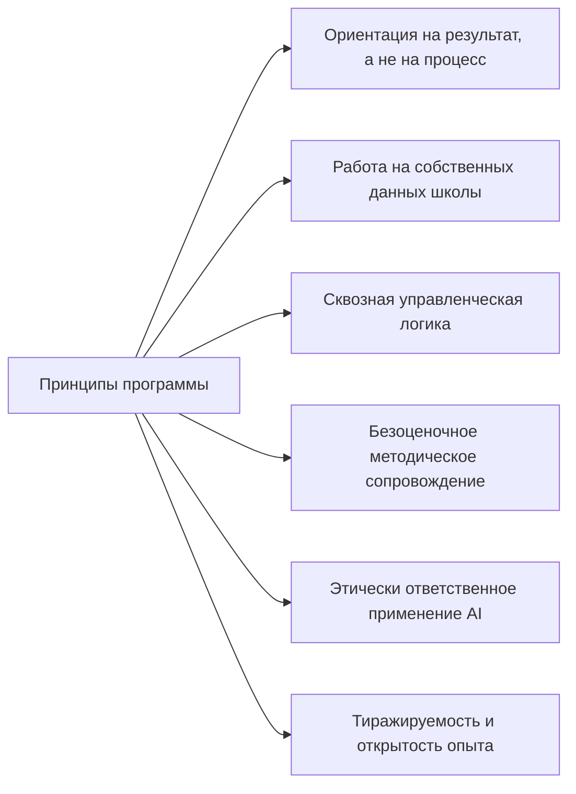
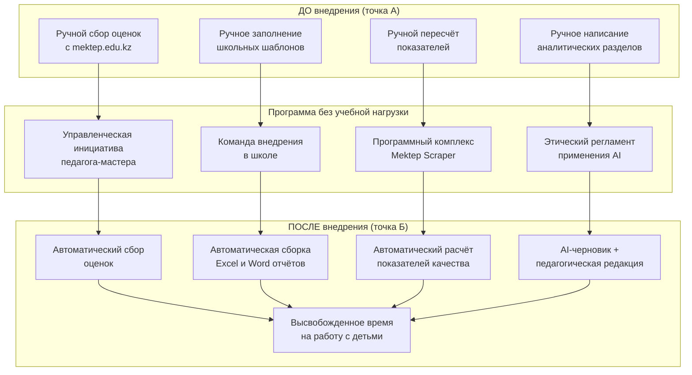
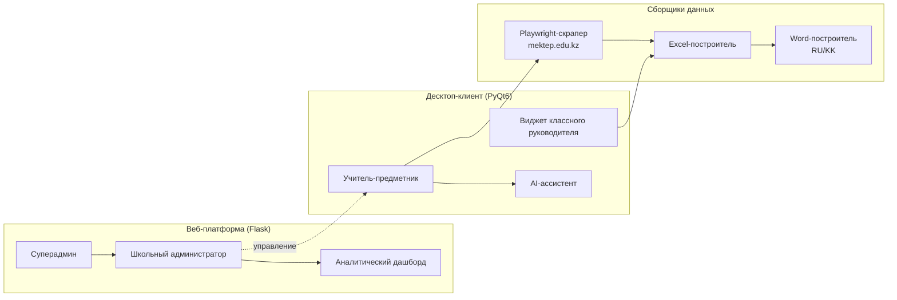
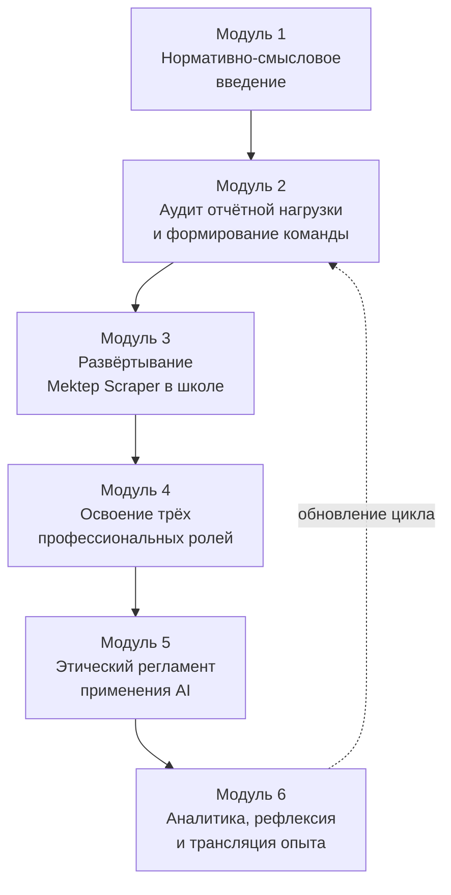
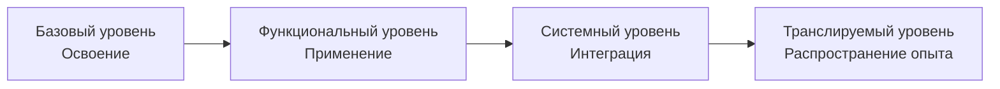
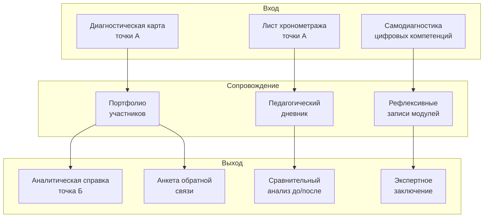
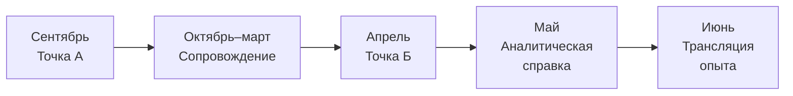
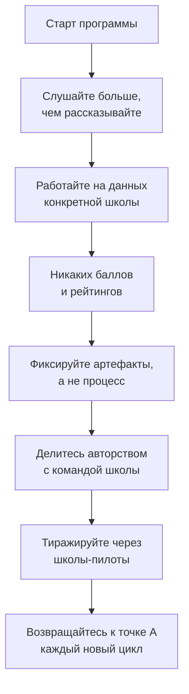
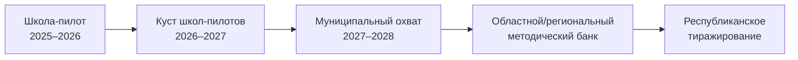

# АВТОРСКАЯ ПРОГРАММА (без учебной нагрузки)

## «Цифровая трансформация отчётной деятельности школы средствами программного комплекса Mektep Scraper: управленческо-методическая инициатива педагога-мастера»

**Тип документа:** авторская программа без учебной нагрузки (без указания академических часов и без привязки к учебному плану и расписанию занятий) — управленческо-методическая инициатива педагога-мастера общеобразовательной организации Республики Казахстан.

**Разработана** в соответствии с:
- Приказом Министра образования и науки Республики Казахстан от 27 января 2016 года № 83 «Об утверждении Правил и условий проведения аттестации педагогов» (в редакции приказа Министра просвещения РК от 25.02.2025 № 32);
- Инструкцией по разработке авторской программы (без учебной нагрузки), утверждённой методическими рекомендациями Министерства просвещения Республики Казахстан;
- Приложением 9 к Методическим рекомендациям МП РК (раздел 4, подраздел 4.2, пункты 1), 2)) — в части требований к титульному листу и пояснительной записке.

---

## Содержание документа

| № | Раздел |
|---|--------|
|   | Титульный лист |
| 1 | Пояснительная записка |
| 2 | Цель и задачи программы |
| 3 | Концепция и авторский подход |
| 4 | Содержательные модули (без учебно-тематического плана) |
| 5 | Индикаторы достижения планируемых результатов |
| 6 | Формы и инструменты мониторинга и оценки результатов |
| 7 | Ожидаемые результаты |
| 8 | Методическое обеспечение (кейсы, лайфхаки, авторские приёмы) |
| 9 | Заключение |
| 10 | Приложения |

---

## Титульный лист

**Наименование организации образования:**

_____________________________________________________________________________
*(указать полное официальное наименование школы / организации образования)*

**Рассмотрено:**
на заседании методического совета организации образования,
протокол № ______ от «____» __________________ 2025 г.

**Согласовано:**
заместитель директора по учебно-воспитательной работе
_____________________________________ / ___________________________ /
            *(ФИО)*                                *(подпись)*

**Утверждено:**
директор организации образования
_____________________________________ / ___________________________ /
            *(ФИО)*                                *(подпись, печать)*
приказ № ______ от «____» __________________ 2025 г.

**Рекомендовано к реализации:** методическим / научно-методическим / экспертным советом соответствующего уровня (после рассмотрения настоящей программы как самостоятельного методического продукта).

---

### Полное наименование программы

**Авторская программа (без учебной нагрузки)**
**«Цифровая трансформация отчётной деятельности школы средствами программного комплекса Mektep Scraper: управленческо-методическая инициатива педагога-мастера»**

### Целевая аудитория реализации

**Организации образования Республики Казахстан, работающие с порталом электронного журнала mektep.edu.kz:**
- общеобразовательные школы, гимназии, лицеи;
- специализированные и малокомплектные школы;
- методические центры и институты повышения квалификации, сопровождающие школы — пользователи портала mektep.edu.kz.

**Прямые участники реализации программы внутри организации образования:**
- администрация школы (директор, заместители директора по учебно-воспитательной работе);
- руководители школьных методических объединений (ШМО);
- классные руководители и учителя-предметники;
- наставники и педагоги-исследователи школы.

**Обязательное условие участия:** наличие у педагогов действующих учётных записей на портале mektep.edu.kz.

### Краткие параметры программы (без указания учебной нагрузки)

| Параметр | Значение |
|---|---|
| Вид программы | авторская программа без учебной нагрузки (управленческо-методическая инициатива) |
| Срок реализации | 1 учебный год (2025–2026) с возможностью пролонгации |
| Форма реализации | внутришкольная инициатива; проектно-методическое сопровождение коллектива |
| Уровень реализации | школьный → межшкольный → муниципальный (по мере тиражирования) |
| Привязка к учебному плану | отсутствует (вне расписания занятий) |
| Балльное оценивание участников | не применяется |
| Язык реализации | русский (с возможностью адаптации казахскоязычного контура) |

### Автор программы

| Поле | Данные |
|---|---|
| ФИО автора (полностью) | _____________________________________________ |
| Должность | _____________________________________________ |
| Квалификационная категория | педагог-мастер |
| Место работы | _____________________________________________ |
| Населённый пункт | _____________________________________________ |
| Область | _____________________________________________ |
| Год разработки | 2025 |

---

## 1. Пояснительная записка

### 1.1. Общие положения и адресность программы

Настоящая авторская программа (без учебной нагрузки) разработана в соответствии с Инструкцией по разработке авторской программы (без учебной нагрузки) и реализуется **без указания учебной нагрузки (часов) и без привязки к учебному плану и расписанию занятий**.

Программа адресована **организациям образования Республики Казахстан, работающим с порталом электронного журнала mektep.edu.kz** — общеобразовательным школам, гимназиям, лицеям, специализированным школам, малокомплектным школам, а также методическим центрам и институтам повышения квалификации, сопровождающим школы — пользователи указанного портала. Прямыми участниками реализации программы являются управленческий и педагогический коллектив организации образования: администрация (директор, заместители директора по учебно-воспитательной работе), руководители школьных методических объединений, классные руководители и учителя-предметники.

Программа предназначена для реализации в формате внутришкольной (или межшкольной) управленческо-методической инициативы — без выведения слушателей с уроков, без курсовой формы, без выставления баллов и формирования рейтингов.

**Обязательное условие реализации программы** — наличие у организации образования действующих учётных записей педагогов на портале mektep.edu.kz, поскольку именно с него программный комплекс Mektep Scraper автоматически собирает данные для формирования отчётности.

### 1.2. Назначение программы

В соответствии с разделом 2 Инструкции, настоящая программа направлена на:

- **реализацию управленческих, методических и педагогических инициатив** по цифровизации внутришкольной отчётной деятельности;
- **устранение образовательных дефицитов** педагогов в области функциональной и цифровой грамотности;
- **обобщение и трансляцию педагогического и управленческого опыта** автора-педагога-мастера, разработавшего программный комплекс Mektep Scraper;
- **реализацию внутришкольных программ развития** и повышения профессиональной компетентности педагогов;
- **проектную, аналитическую, консультационную и экспериментальную деятельность** на базе школы.

### 1.3. Актуальность

Подготовка отчётной документации (сводные ведомости, отчёты классного руководителя, анализы СОР/СОЧ, четвертные и полугодовые сводки) занимает у педагогов Казахстана десятки часов рабочего времени в каждом отчётном периоде. Закон РК «О статусе педагога» от 27 декабря 2019 года № 293-VI ЗРК закрепляет защиту педагога от избыточной бюрократической нагрузки как государственный приоритет, а Приказ МОН РК № 130 от 06.04.2020 г. (с изменениями на 19.05.2025 г.) последовательно сокращает обязательный перечень документов педагога. Однако технология их подготовки в большинстве школ остаётся ручной.

Авторская программа отвечает на этот вызов: предлагает школьному коллективу освоить и внедрить **готовый программный комплекс Mektep Scraper**, разработанный автором, и перейти от ручного формирования отчётов к их автоматической сборке — в логике «меньше кликов — больше педагогического смысла».

### 1.4. Методологические основания

В соответствии с разделом 3 Инструкции, при разработке программы автор опирался на следующие подходы:

- **системный подход** — программа охватывает три профессиональные роли (учитель-предметник, классный руководитель, заместитель директора) и выстраивает сквозной маршрут отчёта внутри школы;
- **деятельностный подход** — все мероприятия программы организованы как практическая деятельность участников на собственных рабочих данных;
- **компетентностный подход** — индикаторы программы сформулированы в терминах действий, продуктов и наблюдаемого поведения, а не часов обучения;
- **управленческий подход** — программа выстроена как внутришкольный проект с распределением ответственности, дорожной картой и измеримыми результатами;
- **рефлексивно-аналитический подход** — каждый модуль завершается рефлексивной фиксацией изменений и аналитической справкой.

**Ключевой принцип** реализации программы — **ориентация на результат, а не на процесс** (раздел 3 Инструкции). Все модули, индикаторы и формы мониторинга строятся вокруг конкретных продуктов деятельности и измеримых изменений в работе школы.

### 1.5. Авторская новизна

| Элемент новизны | Содержание |
|---|---|
| Авторский программный продукт | Программа основана на собственной разработке автора — программном комплексе Mektep Scraper (веб-платформа на Flask + десктоп-клиент на PyQt6 + AI-модуль на базе Qwen/DashScope). Это первая в РК авторская программа без учебной нагрузки, опирающаяся на собственное программное обеспечение педагога|
| Сквозной школьный маршрут | Программа объединяет три роли (учитель → классный руководитель → завуч) в единой управленческой логике, что отсутствует в существующих программах ИКТ-сопровождения школ |
| Этически ответственный AI | Впервые на уровне школьной методической инициативы вводится регламент этического применения ИИ-ассистента в подготовке официальных школьных документов |
| Безчасовой формат | Программа реализуется без выведения учителей с уроков, без курсовой нагрузки и без балльного оценивания — что соответствует инструкции по разработке авторской программы без учебной нагрузки |

### 1.6. Принципы реализации программы

### 1.7. Краткий обзор разделов программы

- **Раздел 2** формулирует цель и задачи программы.
- **Раздел 3** раскрывает концептуальное ядро авторского замысла.
- **Раздел 4** описывает шесть содержательных модулей через направление деятельности, ключевые действия участников, предполагаемые формы реализации и ожидаемые результаты.
- **Раздел 5** задаёт систему индикаторов достижения результатов в терминах действий, умений и продуктов деятельности.
- **Раздел 6** описывает инструментарий мониторинга (диагностические карты, портфолио, аналитика «до/после», экспертные заключения, самооценка и рефлексия).
- **Раздел 7** перечисляет ожидаемые результаты на трёх уровнях (педагог, школа, методическая система).
- **Раздел 8** содержит методическое обеспечение программы — авторские кейсы, лайфхаки, типовые приёмы.
- **Раздел 9** обобщает выводы и фиксирует перспективы тиражирования программы.
- **Раздел 10** — приложения с поддерживающим инструментарием.

---

## 2. Цель и задачи программы

### 2.1. Цель программы

Создать в общеобразовательной организации устойчивую модель **цифровой трансформации отчётной деятельности** на основе авторского программного комплекса Mektep Scraper, обеспечивающую сокращение временных затрат педагогов на подготовку отчётности, повышение функциональной и цифровой грамотности коллектива и распространение полученного опыта в профессиональной среде Республики Казахстан.

### 2.2. Задачи программы

| № | Задача | Ориентация |
|---|---|---|
| 1 | Провести инвентаризацию текущей отчётной нагрузки педагогов школы | управленческая |
| 2 | Сформировать школьную команду внедрения (администратор + 2–3 педагога-пилота) | организационная |
| 3 | Развернуть и настроить программный комплекс Mektep Scraper на инфраструктуре школы | технологическая |
| 4 | Освоить ключевые сценарии работы (учитель / классный руководитель / завуч) на реальных данных школы | методическая |
| 5 | Внедрить этический регламент применения AI-ассистента в подготовке школьных документов | нормативно-этическая |
| 6 | Организовать систему внутришкольного сопровождения и наставничества | методическая |
| 7 | Зафиксировать измеримые изменения «до / после» внедрения и оформить аналитическую справку | аналитическая |
| 8 | Транслировать опыт школы в межшкольное и муниципальное профессиональное сообщество | методическая |

---

## 3. Концепция и авторский подход

### 3.1. Концептуальное ядро

Главная авторская идея: **перевод школы из режима «ручной сборки отчётов» в режим «автоматизированной сборки отчётов с педагогической интерпретацией»**. Технические операции (авторизация в электронном журнале, сбор оценок, заполнение шаблонов, сведение итоговых таблиц) делегируются программному комплексу Mektep Scraper, а педагог сосредотачивается на содержательном анализе результатов: выявлении затруднений обучающихся, проектировании коррекционной работы, формулировании рекомендаций.

Концептуальная формула программы — **«меньше кликов — больше смысла»**.

### 3.2. Авторская модель цифровой трансформации отчётности

### 3.3. Авторский подход к организации работы коллектива

| Элемент авторского подхода | Содержание |
|---|---|
| Принцип «свои данные с первого шага» | Уже на первом мероприятии участники работают с реальными классами и предметами своей школы, а не с учебными примерами |
| Принцип сквозного маршрута | Внедрение охватывает три роли одновременно (учитель — классный руководитель — завуч), что обеспечивает целостный «маршрут отчёта» |
| Принцип парного сопровождения | Каждый педагог-пилот закрепляется за заместителем директора своей школы для парной работы |
| Принцип безоценочной рефлексии | Никакие баллы и рейтинги не выставляются; результат фиксируется через продукты деятельности и самооценку участников |
| Принцип AI-этики | Перед использованием AI-модуля коллектив принимает внутренний регламент: что допустимо передавать в промпт, как педагог верифицирует AI-текст |
| Принцип открытого тиражирования | Все авторские артефакты (регламенты, чек-листы, дорожные карты) публикуются в режиме открытого методического банка школы |

### 3.4. Архитектура авторского программного комплекса (опора программы)

---

## 4. Содержательные модули (без учебно-тематического плана)

В соответствии с разделом 5 Инструкции, программа включает **содержательные модули (блоки)** вместо традиционного учебно-тематического плана с распределением часов. Каждый модуль описывается через четыре обязательных параметра:

1. **направление деятельности**;
2. **ключевые действия участников**;
3. **предполагаемые формы реализации**;
4. **ожидаемые результаты**.

Последовательность и продолжительность модулей определяются автором программы и могут изменяться в зависимости от условий реализации (раздел 5 Инструкции).

### 4.1. Карта содержательных модулей

### 4.2. Модуль 1. Нормативно-смысловое введение

| Параметр модуля | Содержание |
|---|---|
| **Направление деятельности** | Информационно-нормативное и ценностно-смысловое введение коллектива школы в проблематику цифровизации отчётной деятельности |
| **Ключевые действия участников** | Изучение действующей нормативной базы (Закон РК «О статусе педагога» № 293-VI, Приказ МОН РК № 130 от 06.04.2020 г., Приказ МП РК № 31 от 24.02.2025 г., Приказ МП РК № 348 от 03.08.2022 г.); коллективное обсуждение «что в нашей отчётности избыточно»; формулирование школьного запроса на цифровизацию |
| **Предполагаемые формы реализации** | Открытое заседание методического совета школы; информационно-аналитическая записка; круглый стол педагогов |
| **Ожидаемые результаты** | Сформированное общее понимание коллективом нормативно-правовой рамки и собственного запроса на цифровизацию отчётности; принятое решение методического совета о реализации программы |

### 4.3. Модуль 2. Аудит отчётной нагрузки и формирование школьной команды

| Параметр модуля | Содержание |
|---|---|
| **Направление деятельности** | Управленческая диагностика текущего состояния отчётной деятельности школы и формирование инициативной команды внедрения |
| **Ключевые действия участников** | Заполнение листов хронометража отчётной нагрузки педагогами-пилотами; составление карты «узких мест» отчётной системы школы; формирование команды внедрения (1 заместитель директора + 2–3 педагога-пилота); закрепление ролей и зон ответственности |
| **Предполагаемые формы реализации** | Диагностическая мини-сессия; индивидуальные интервью с педагогами; рабочее совещание команды внедрения |
| **Ожидаемые результаты** | Аналитическая записка «Точка А: текущая отчётная нагрузка школы»; сформированный состав школьной команды внедрения с распределением ролей (матрица RACI); подписанный регламент работы команды |

### 4.4. Модуль 3. Развёртывание программного комплекса Mektep Scraper в школе

| Параметр модуля | Содержание |
|---|---|
| **Направление деятельности** | Технологическое развёртывание авторского программного комплекса на инфраструктуре школы |
| **Ключевые действия участников** | Установка веб-платформы (Flask) на школьный сервер либо подключение к централизованной инсталляции; первичная настройка AI-ключа (DashScope) и квот; установка десктоп-клиента Mektep Desktop на рабочих местах педагогов-пилотов; первичная авторизация и проверка связи; создание структуры школы (учителя, классы, предметы) в веб-интерфейсе |
| **Предполагаемые формы реализации** | Технический практикум; наставническая консультация автора программы; мастер-класс «от 0 до первого отчёта» |
| **Ожидаемые результаты** | Развёрнутая и проверенная инсталляция Mektep Scraper в школе; сформированная структура школы в веб-интерфейсе; рабочие копии десктоп-клиента у педагогов-пилотов; сохранённая инструкция «как мы это сделали» |

### 4.5. Модуль 4. Освоение трёх профессиональных ролей

| Параметр модуля | Содержание |
|---|---|
| **Направление деятельности** | Практическое освоение функциональных сценариев программного комплекса в трёх профессиональных ролях: учитель-предметник, классный руководитель, заместитель директора |
| **Ключевые действия участников** | **Учитель-предметник:** запуск автоматического сбора оценок, сборка Excel- и Word-отчётов, редактирование целей обучения. **Классный руководитель:** формирование сводного отчёта по группам обучающихся (отличники, хорошисты, «с одной 4», «с одной 3», группы риска), интерпретация результатов. **Заместитель директора:** работа с аналитическим дашбордом, формирование сводных Excel-экспортов, аналитика «класс × предмет», аналитика по параллелям |
| **Предполагаемые формы реализации** | Парные практикумы «учитель + завуч»; ролевые мастер-классы; разбор кейсов из реальной отчётной практики школы |
| **Ожидаемые результаты** | Шесть рабочих артефактов команды внедрения: настроенный десктоп-клиент, готовый Excel-отчёт предметника, готовый Word-отчёт предметника, отчёт классного руководителя, аналитическая справка по параллели, заполненная структура школы. Каждый из артефактов используется в реальной работе |

### 4.6. Модуль 5. Этический регламент применения AI-ассистента

| Параметр модуля | Содержание |
|---|---|
| **Направление деятельности** | Нормативно-этическая работа коллектива по выработке внутришкольного регламента применения AI-ассистента в подготовке официальных школьных документов |
| **Ключевые действия участников** | Изучение принципов работы LLM (Qwen/DashScope) и рисков (галлюцинации, шаблонность); формирование школьного перечня «что допустимо передавать в промпт» (запрет на ИИН, полные ФИО обучающихся); отработка чек-листа педагогической верификации AI-черновика; принятие школьного регламента применения AI |
| **Предполагаемые формы реализации** | Этическая мастерская; разбор учебных кейсов «AI ошибся — что делать педагогу»; рабочее совещание методического совета по утверждению регламента |
| **Ожидаемые результаты** | Утверждённый методическим советом школы регламент этического применения AI-ассистента; чек-лист педагогической верификации AI-черновика; сформированный навык педагогов критически читать и редактировать AI-текст |

### 4.7. Модуль 6. Аналитика «до/после», рефлексия и трансляция опыта

| Параметр модуля | Содержание |
|---|---|
| **Направление деятельности** | Аналитическое и рефлексивное завершение цикла, трансляция полученного опыта в межшкольное и муниципальное профессиональное сообщество |
| **Ключевые действия участников** | Повторный хронометраж отчётной нагрузки (точка Б); сравнительный анализ «до/после»; подготовка аналитической справки по итогам внедрения; подготовка дорожной карты тиражирования опыта; представление результатов на методическом объединении района / города; публикация авторского кейса в школьном методическом банке |
| **Предполагаемые формы реализации** | Рефлексивный круглый стол команды внедрения; открытое представление итогов на методическом совете школы; межшкольный методический семинар; публикация в профессиональной среде |
| **Ожидаемые результаты** | Аналитическая справка «до/после»; дорожная карта тиражирования; публичное представление результатов на межшкольном уровне; пакет открытых методических материалов для других школ |

### 4.8. Гибкость последовательности модулей

В соответствии с разделом 5 Инструкции, последовательность и продолжительность модулей определяются автором программы и могут изменяться в зависимости от условий реализации. Возможные сценарии адаптации:

- **«Длинный год»** — каждый модуль реализуется в течение 1,5–2 месяцев (полный учебный год);
- **«Короткий цикл»** — модули 1–3 реализуются в течение одного отчётного периода (четверть), модули 4–6 — в следующем;
- **«Ремонтный сценарий»** — при наличии в школе уже развёрнутого программного комплекса модуль 3 пропускается, акцент смещается на модули 4–6.

---

## 5. Индикаторы достижения планируемых результатов

В соответствии с разделом 6 Инструкции, результаты реализации программы фиксируются через индикаторы, которые:

- отражают **динамику изменений**;
- являются **измеримыми и наблюдаемыми**;
- формулируются в терминах **действий, умений, продуктов деятельности**;
- **сгруппированы по уровням достижения**.

**Использование учебных часов в качестве критерия оценки не допускается** (раздел 6 Инструкции).

### 5.1. Структура индикаторов по уровням достижения

### 5.2. Индикаторы по уровням достижения

| Уровень | Индикатор (наблюдаемое действие / продукт) | Источник фиксации |
|---|---|---|
| **Базовый (освоение)** | Педагог-пилот самостоятельно запускает десктоп-клиент Mektep Desktop и получает первый Excel-отчёт по своему классу | Файл-артефакт + скриншот процесса |
| **Базовый (освоение)** | Заместитель директора создал в веб-платформе структуру школы (учителя, классы, предметы) | Скриншот аккордеона школы |
| **Базовый (освоение)** | Команда внедрения изучила нормативную базу (НПА из модуля 1) | Конспект-памятка по НПА |
| **Функциональный (применение)** | Педагог-пилот самостоятельно собирает Word-отчёт по утверждённому школьному шаблону | Готовый Word-файл |
| **Функциональный (применение)** | Классный руководитель формирует сводный отчёт по группам обучающихся | Сводный отчёт по реальному классу |
| **Функциональный (применение)** | Заместитель директора готовит аналитическую справку по параллели через дашборд | Аналитическая справка в формате Word/PDF |
| **Функциональный (применение)** | Коллектив принял этический регламент применения AI | Утверждённый регламент с печатью школы |
| **Системный (интеграция)** | Программный комплекс используется педагогами в реальной работе минимум один отчётный период | Журнал учёта формирований отчётов в системе |
| **Системный (интеграция)** | Хронометраж «до/после» подтверждает сокращение времени подготовки отчёта | Сравнительный лист хронометража |
| **Системный (интеграция)** | Школа сформировала собственный методический банк документов по программе | Папка/раздел сайта школы |
| **Транслируемый (распространение)** | Команда внедрения провела открытое мероприятие для другой школы / методического объединения | Программа мероприятия + список участников |
| **Транслируемый (распространение)** | Опубликован авторский кейс в профессиональной среде | Ссылка на публикацию |

### 5.3. Целевые ориентиры динамики

| Показатель динамики | Целевой ориентир | Способ измерения |
|---|---|---|
| Доля педагогов-пилотов, освоивших базовый уровень | не менее 100 % команды внедрения | продукт-артефакт по каждому участнику |
| Сокращение времени подготовки четвертного отчёта | не менее чем в 5 раз (с 6–10 ч до 30–60 мин) | сравнительный хронометраж |
| Доля коллектива, прошедшего внутришкольный мастер-класс | не менее 70 % педагогов школы | список участников мастер-класса |
| Количество созданных артефактов | не менее 6 рабочих артефактов на школу | портфолио команды внедрения |
| Количество транслирующих мероприятий | не менее 1 за учебный год | программа мероприятия |

---

## 6. Формы и инструменты мониторинга и оценки результатов

В соответствии с разделом 7 Инструкции, мониторинг включает диагностические карты, портфолио участников, сравнительный анализ «до/после», аналитические справки, экспертные заключения, самооценку и рефлексию. Все показатели мониторинга **валидны и измеряемы**.

### 6.1. Архитектура системы мониторинга

### 6.2. Инструментарий мониторинга

| Инструмент | Назначение | Когда применяется | Кто заполняет |
|---|---|---|---|
| Диагностическая карта школы (точка А) | Фиксация исходного состояния отчётной деятельности | Модуль 2 | Команда внедрения совместно |
| Лист хронометража педагога | Фиксация фактических временных затрат на отчёт | Модули 2 и 6 | Каждый педагог-пилот лично |
| Лист самодиагностики цифровых компетенций | Фиксация субъективной готовности педагога | Модули 1 и 6 | Каждый участник лично |
| Портфолио команды внедрения | Сбор всех артефактов программы | На протяжении всех модулей | Координатор команды |
| Педагогический дневник | Личная рефлексивная запись | На протяжении всех модулей | Каждый педагог лично |
| Чек-лист проверки Excel-отчёта | Самопроверка корректности выгрузки | Модули 4 и 6 | Педагог-предметник |
| Чек-лист проверки Word-отчёта | Самопроверка полноты разделов | Модули 4 и 6 | Педагог-предметник |
| Чек-лист педагогической верификации AI-текста | Самопроверка качества AI-черновика | Модули 5 и 6 | Каждый педагог |
| Аналитическая справка (точка Б) | Фиксация итогового состояния | Модуль 6 | Координатор команды |
| Сравнительный анализ «до / после» | Подтверждение динамики | Модуль 6 | Координатор + завуч |
| Экспертное заключение методического совета | Внешняя оценка результатов программы | Модуль 6 | Методический совет школы |
| Анкета обратной связи участника | Качественная обратная связь от каждого | Модуль 6 | Каждый участник лично |

### 6.3. Принципы мониторинга

- **Валидность.** Каждый показатель привязан к конкретному наблюдаемому действию или продукту (например, «педагог сформировал Excel-отчёт» — наличие файла и его дата).
- **Измеримость.** Количественные показатели (часы хронометража, число артефактов, доля педагогов) выражены в чёткой шкале.
- **Безоценочность.** Программа **не выставляет балльных оценок участникам**: все измерения служат для самооценки коллектива и коррекции дальнейших шагов.
- **Сопоставимость.** Точка А и точка Б замеряются одним и тем же инструментом для корректного сравнительного анализа.
- **Прозрачность.** Все инструменты мониторинга открыты для участников; каждый видит собственные данные и общую сводку по школе.

### 6.4. Цикл мониторинга в течение учебного года

---

## 7. Ожидаемые результаты

Ожидаемые результаты программы группируются по трём уровням, отражающим масштаб эффекта от реализации.

### 7.1. Уровень педагога

- сокращение фактического времени подготовки четвертного и полугодового отчёта в 5 и более раз;
- освоение программного комплекса Mektep Scraper в одной из трёх ролей (учитель / классный руководитель / завуч);
- формирование устойчивого навыка критической верификации автоматически сгенерированных данных и AI-черновиков;
- рост субъективной уверенности в применении цифровых инструментов в профессиональной деятельности;
- индивидуальный пакет рабочих артефактов, используемых в реальной работе.

### 7.2. Уровень школы

- развёрнутая и устойчиво работающая инсталляция программного комплекса Mektep Scraper;
- сформированная команда внедрения и наставническая модель сопровождения коллектива;
- утверждённый методическим советом школы этический регламент применения AI;
- внутришкольный методический банк (регламенты, чек-листы, дорожные карты, образцы отчётов);
- аналитическая справка «до / после» с подтверждённой динамикой;
- снижение административной нагрузки на коллектив и высвобождение времени педагога на работу с обучающимися.

### 7.3. Уровень профессиональной системы

- авторский кейс школы, представленный на межшкольном / муниципальном / областном уровне;
- готовая дорожная карта тиражирования программы для других школ Республики Казахстан;
- открытый пакет методических материалов в свободном доступе для коллег;
- реализация автором программы функции педагога-мастера в части «развития сети профессионального сообщества» (Приказ МОН РК № 338 от 13.07.2009 г.);
- вклад в реализацию государственной политики защиты педагога от избыточной отчётной нагрузки (Закон «О статусе педагога» № 293-VI).

### 7.4. Согласование результатов с задачами программы

| Задача программы (раздел 2.2) | Подтверждающий результат |
|---|---|
| Инвентаризация отчётной нагрузки | Аналитическая записка «Точка А» |
| Формирование школьной команды | Состав команды + матрица RACI |
| Развёртывание Mektep Scraper | Рабочая инсталляция + инструкция «как мы это сделали» |
| Освоение трёх ролей | Шесть рабочих артефактов команды |
| Этический регламент AI | Утверждённый школьный регламент |
| Внутришкольное сопровождение | Действующая наставническая пара / тройка |
| Аналитика «до / после» | Сравнительный лист хронометража + аналитическая справка |
| Трансляция опыта | Программа межшкольного мероприятия + публикация |

---

## 8. Методическое обеспечение программы

В соответствии с разделом 4 Инструкции, методическое обеспечение программы представлено **авторским практико-ориентированным материалом** — кейсами, лайфхаками и авторскими приёмами, накопленными в ходе разработки и пилотного применения программного комплекса Mektep Scraper.

### 8.1. Авторские кейсы

#### Кейс 1. «Учитель в трёх школах»

**Ситуация.** Учитель совмещает работу в трёх общеобразовательных школах. При запуске десктоп-клиента он автоматически авторизуется в портале mektep.edu.kz, и система обнаруживает несколько привязок.

**Авторское решение.** В программный комплекс встроен всплывающий диалог выбора школы. Учитель один раз выбирает текущую школу, дальнейшая работа ведётся только с её данными. Это решает типовую проблему «учителей-совместителей» без отдельной перенастройки.

**Педагогический смысл кейса.** Помогает участникам программы увидеть, что инструмент изначально проектировался для реальной школы РК, а не для лабораторных условий.

#### Кейс 2. «Учитель забыл, куда сохранился отчёт»

**Ситуация.** На пилотных встречах педагоги массово задавали вопрос: «Я нажал кнопку, но где теперь файл?»

**Авторское решение.** В десктоп-клиенте предусмотрено отдельное окно «История отчётов» с кнопкой «Открыть папку». Дополнительно по завершении сборки выводится уведомление с прямой ссылкой на файл.

**Лайфхак для ведущего.** На первом практикуме сразу попросите участников открыть «Историю отчётов» и закрепите её на видном месте интерфейса.

#### Кейс 3. «AI ответил формальными штампами»

**Ситуация.** AI-ассистент при первой генерации затруднений и причин выдал шаблонный текст вида «обучающимся следует уделять больше внимания», без привязки к реальной картине класса.

**Авторское решение.** В регламент программы введён обязательный шаг — **педагогическая редакция AI-черновика**. Чек-лист педагогической верификации содержит позиции: «есть ли привязка к конкретным целям обучения?», «есть ли указание на конкретные уровни достижения?», «исключены ли обобщённые формулировки?».

**Лайфхак.** Перед запуском AI отредактируйте формулировки целей обучения в карточке предмета — чем точнее цели, тем релевантнее AI-черновик.

#### Кейс 4. «Завуч не верит цифрам»

**Ситуация.** При первом представлении автоматически сформированной аналитической справки заместитель директора не поверил числам и потребовал ручную перепроверку.

**Авторское решение.** В программу введён шаг «открытая верификация»: на одном из совещаний методического совета школы команда внедрения выводит аналитический дашборд на проектор и параллельно с ручной выборкой подтверждает совпадение значений. После такой публичной верификации доверие к системе фиксируется протоколом методического совета.

**Педагогический смысл.** Доверие к цифровому инструменту нельзя «продать» — его нужно совместно подтвердить.

#### Кейс 5. «Малокомплектная школа без сервера»

**Ситуация.** В сельской малокомплектной школе нет собственного сервера для развёртывания веб-платформы.

**Авторское решение.** Программа предусматривает централизованное развёртывание веб-платформы силами автора (или муниципального методического центра) с предоставлением школе только учётных записей. Десктоп-клиент работает у каждого педагога локально и подключается к централизованной платформе через интернет.

**Лайфхак.** Для школ с нестабильным интернетом предусмотрен сценарий «офлайн-сборка»: десктоп-клиент сначала собирает данные локально, затем синхронизирует их с платформой при появлении связи.

### 8.2. Авторские лайфхаки реализации программы

| № | Лайфхак | Зачем нужен |
|---|---|---|
| 1 | Начинайте с заместителя директора, а не с педагогов | Завуч задаёт темп и обеспечивает административную поддержку |
| 2 | Первый отчёт собирайте за тот период, который уже сдан вручную | Это позволит сразу сравнить «ручной» и «автоматический» результат |
| 3 | Вынесите хронометраж в общую таблицу команды | Личные числа становятся коллективным аргументом |
| 4 | Зафиксируйте «до» письменно, прежде чем коснуться кнопки «Запуск» | Без точки А не будет точки Б |
| 5 | Сохраняйте все скриншоты процесса в общую папку | Они станут материалом методического банка |
| 6 | Регламент AI принимайте до первого массового использования | Проще принять правила «на берегу», чем переучивать коллектив |
| 7 | Парную работу «учитель + завуч» оформляйте приказом | Это снимает вопрос «зачем мне это нужно» |
| 8 | На итоговой презентации показывайте не «что делает программа», а «что изменилось у нас» | Управленческая логика убедительнее технологической |

### 8.3. Авторские приёмы трансляции опыта

| Приём | Когда применяется | Что даёт |
|---|---|---|
| «Открытый рабочий день» | Школа открывает свой методический день для коллег из других школ | Демонстрация инструмента в реальном контексте, без презентационных артефактов |
| «Парный мастер-класс автор + школа-пилот» | Совместное мероприятие автора программы и команды внедрения | Школа выступает как соавтор опыта, что повышает её мотивацию к дальнейшему развитию |
| «Методический банк-чемодан» | Школа упаковывает все свои регламенты, чек-листы и инструкции в единую папку | Коллеги получают готовый пакет, а не отдельные документы |
| «Видеодневник внедрения» | Команда снимает короткие 3–5-минутные ролики на ключевых этапах | Опыт сохраняется и переиспользуется для последующих волн внедрения |
| «Профессиональная супервизия» | Автор программы регулярно встречается с командами школ-пилотов в формате супервизии | Снимает технические и методические затруднения «по горячим следам» |

### 8.4. Авторская памятка ведущему программы (педагогу-мастеру)

### 8.5. Перечень дидактических и методических материалов

| Материал | Назначение |
|---|---|
| Программный комплекс Mektep Scraper (веб + десктоп) | Технологическая основа программы |
| Школьные шаблоны Excel-отчёта | Учебный материал для практической работы |
| Школьные шаблоны Word-отчёта (RU/KK) | Учебный материал для практической работы |
| Тестовая инсталляция учебной школы | Безопасная отработка действий без риска для реальных данных |
| Чек-листы проверки (Excel, Word, AI) | Самопроверка участников |
| Регламент этического применения AI (типовой) | Шаблон для адаптации под конкретную школу |
| Лист хронометража педагога | Инструмент сравнительного анализа |
| Диагностическая карта школы | Инструмент фиксации исходного состояния |
| Методическое пособие автора программы | Сопровождающее издание (см. [МЕТОДИЧЕСКОЕ_ПОСОБИЕ_СОДЕРЖАНИЕ.md](МЕТОДИЧЕСКОЕ_ПОСОБИЕ_СОДЕРЖАНИЕ.md)) |
| Программа апробации | Методика опытно-экспериментальной проверки (см. [ПРОГРАММА_АПРОБАЦИИ.md](ПРОГРАММА_АПРОБАЦИИ.md)) |

---

## 9. Заключение

### 9.1. Обобщённые выводы

Авторская программа (без учебной нагрузки) **«Цифровая трансформация отчётной деятельности школы средствами программного комплекса Mektep Scraper»** представляет собой завершённый методический продукт, отвечающий требованиям Инструкции по разработке авторской программы (без учебной нагрузки). Программа:

1. Реализуется **без указания учебной нагрузки (часов) и без привязки к учебному плану и расписанию занятий**, что соответствует разделу 1 Инструкции.
2. Отвечает целям и назначению авторской программы без учебной нагрузки (раздел 2 Инструкции): реализует управленческо-методическую инициативу, устраняет образовательный дефицит коллектива, обобщает и транслирует педагогический и управленческий опыт автора-педагога-мастера.
3. Опирается на системный, деятельностный, компетентностный и управленческий подходы (раздел 3 Инструкции), сохраняя ключевой принцип **ориентации на результат, а не на процесс**.
4. Имеет полную структуру, предусмотренную разделом 4 Инструкции (титульный лист, пояснительная записка, цель и задачи, концепция, содержательные модули, индикаторы, мониторинг, ожидаемые результаты, методическое обеспечение, заключение, приложения).
5. Заменяет традиционный учебно-тематический план **содержательными модулями** (раздел 5 Инструкции), каждый из которых описан через направление деятельности, ключевые действия участников, формы реализации и ожидаемые результаты.
6. Использует **измеримые и наблюдаемые индикаторы**, сгруппированные по уровням достижения (базовый — функциональный — системный — транслируемый), без применения учебных часов в качестве критерия оценки (раздел 6 Инструкции).
7. Включает **валидную и измеряемую систему мониторинга** (диагностические карты, портфолио, сравнительный анализ «до / после», аналитические справки, экспертные заключения, самооценку и рефлексию) — раздел 7 Инструкции.

### 9.2. Краткий обзор разделов программы

- **Пояснительная записка** обосновывает адресность, актуальность, методологические основания, авторскую новизну и принципы реализации программы.
- **Цель и задачи программы** формулируются в управленческой логике — создание устойчивой модели цифровой трансформации отчётной деятельности школы.
- **Концепция и авторский подход** раскрывают ключевую формулу программы — «меньше кликов — больше смысла» и шесть авторских принципов организации работы коллектива.
- **Шесть содержательных модулей** покрывают полный цикл внедрения: от нормативно-смыслового введения до трансляции опыта в профессиональную среду.
- **Индикаторы достижения** распределены по четырём уровням (базовый, функциональный, системный, транслируемый), что обеспечивает наблюдаемость прогресса школы и каждого участника.
- **Мониторинг** опирается на 12 валидных и измеримых инструментов, охватывающих вход, сопровождение и выход программы.
- **Ожидаемые результаты** сформулированы на трёх уровнях (педагог, школа, профессиональная система) и согласованы с задачами программы.
- **Методическое обеспечение** включает 5 авторских кейсов, 8 авторских лайфхаков, 5 приёмов трансляции опыта и памятку ведущему программы.

### 9.3. Перспективы тиражирования и развития

1. **Тиражирование** программы на куст школ-партнёров — после первой успешной реализации.
2. **Передача программного комплекса** в открытом доступе другим школам Республики Казахстан.
3. **Адаптация программы** к специфике колледжей (ТиПО) и организаций дополнительного образования.
4. **Разработка казахскоязычного контура** для охвата казахскоязычных педагогических сообществ.
5. **Методическая поддержка** автором программы школ-последователей в формате супервизии и наставничества.
6. **Представление программы** на рассмотрение методических, экспертных и научно-методических советов в качестве **самостоятельного методического продукта** — что соответствует разделу 8 Инструкции.

### 9.4. Соответствие заключительным положениям Инструкции

В соответствии с разделом 8 Инструкции, настоящая авторская программа (без учебной нагрузки) представляется на рассмотрение методических, экспертных и научно-методических советов **как самостоятельный методический продукт**, не привязанный к учебному плану и расписанию, и пригодный для тиражирования в общеобразовательных организациях Республики Казахстан.

---

## 10. Приложения

| Приложение | Название | Содержание |
|---|---|---|
| А | Глоссарий программы | Ключевые понятия: содержательный модуль, индикатор, валидность, диагностическая карта, скрапинг, СОР, СОЧ, LLM, Playwright, Qwen и др. |
| Б | Шаблон аналитической записки «Точка А» | Типовая структура входного аудита отчётной нагрузки школы |
| В | Лист хронометража педагога | Форма для замера времени подготовки отчёта (точки А и Б) |
| Г | Диагностическая карта школы | Бланк для фиксации исходного и итогового состояния отчётной деятельности |
| Д | Чек-листы проверки артефактов | Excel-отчёт, Word-отчёт, AI-черновик |
| Е | Типовой регламент этического применения AI | Шаблон для адаптации под конкретную школу |
| Ж | Шаблон аналитической справки «До / После» | Структура итогового сравнительного документа |
| З | Шаблон дорожной карты тиражирования | Для представления опыта на межшкольном уровне |
| И | Анкета обратной связи участника | Качественная обратная связь по итогам программы |
| К | Памятка ведущему программы | Авторские приёмы и принципы работы педагога-мастера с коллективом школы |

---

**Конец документа авторской программы (без учебной нагрузки).**

**См. также сопутствующие документы:**
- [АВТОРСКАЯ_ПРОГРАММА.md](АВТОРСКАЯ_ПРОГРАММА.md) — авторская программа курса повышения квалификации (с учебной нагрузкой 36 часов).
- [АВТОРСКАЯ_ПРОГРАММА_ПРИЛОЖЕНИЯ.md](АВТОРСКАЯ_ПРОГРАММА_ПРИЛОЖЕНИЯ.md) — комплекс приложений к курсовой авторской программе.
- [ПРОГРАММА_АПРОБАЦИИ.md](ПРОГРАММА_АПРОБАЦИИ.md) — программа опытно-экспериментальной проверки.
- [МЕТОДИЧЕСКОЕ_ПОСОБИЕ_СОДЕРЖАНИЕ.md](МЕТОДИЧЕСКОЕ_ПОСОБИЕ_СОДЕРЖАНИЕ.md) — содержание методического пособия автора программы.
