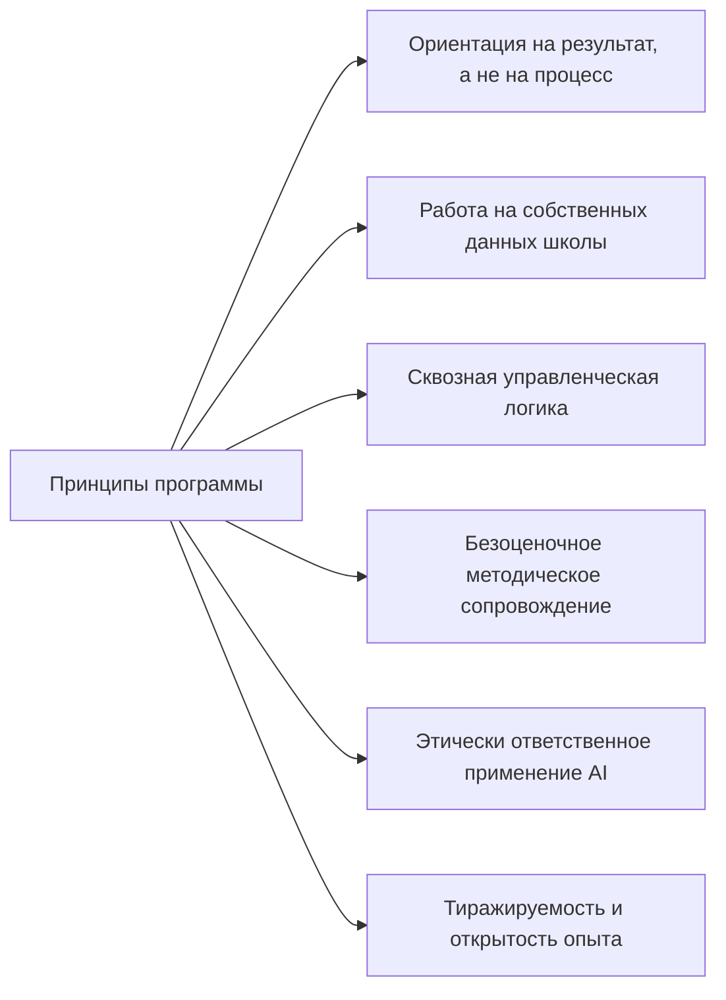
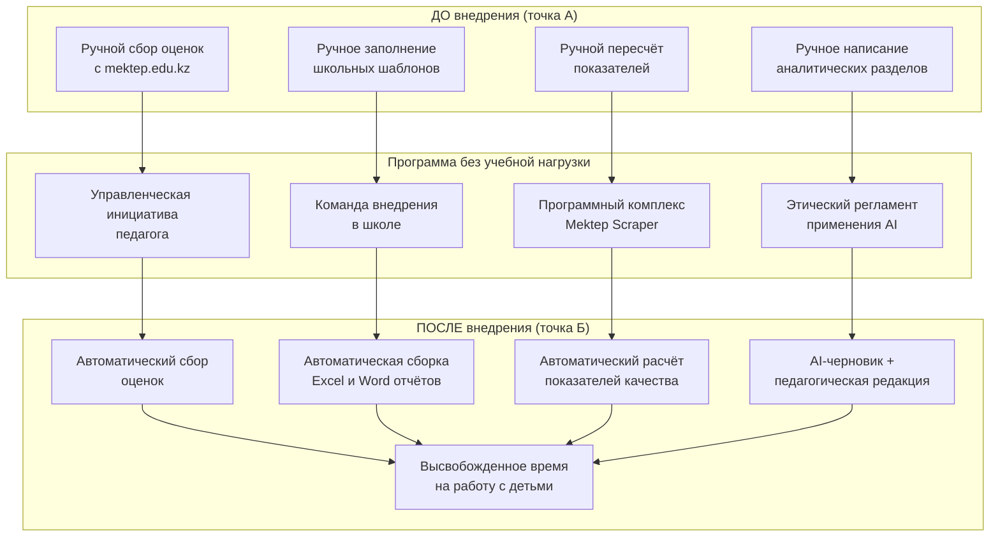
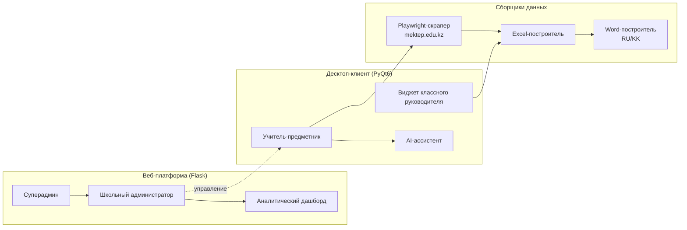
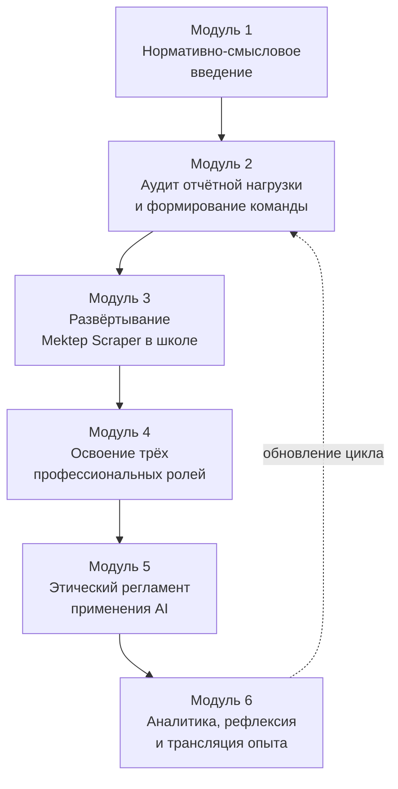
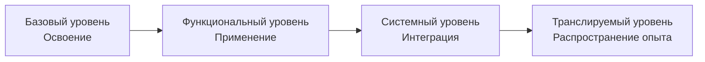
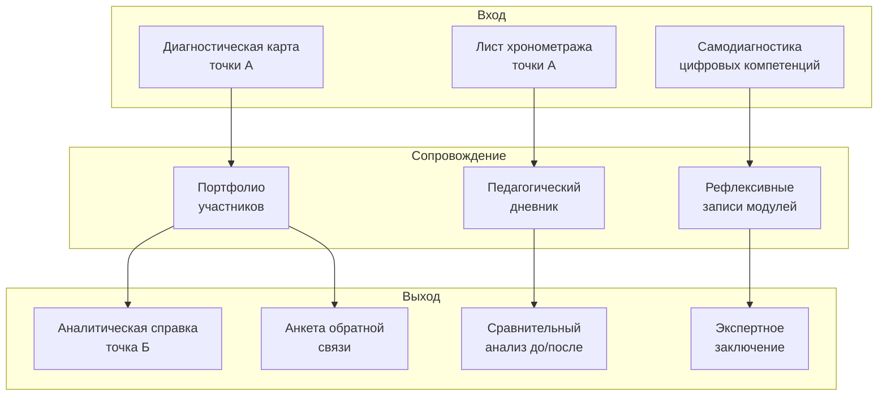
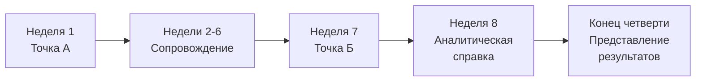
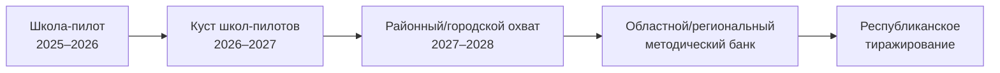

# АВТОРСКАЯ ПРОГРАММА (без учебной нагрузки)

## «Цифровая трансформация отчётной деятельности школы средствами программного комплекса Mektep Scraper: управленческо-методическая инициатива педагога»

**Тип документа:** авторская программа без учебной нагрузки (без указания академических часов и без привязки к учебному плану и расписанию занятий) — управленческо-методическая инициатива педагога для организаций образования Республики Казахстан, работающих с порталом электронного журнала mektep.edu.kz.

**Разработана** в соответствии с:
- Приказом Министра образования и науки Республики Казахстан от 27 января 2016 года № 83 «Об утверждении Правил и условий проведения аттестации педагогов» (в редакции приказа Министра просвещения РК от 25.02.2025 № 32);
- Инструкцией по разработке авторской программы (без учебной нагрузки), представленной в методических рекомендациях Министерства просвещения Республики Казахстан;
- Приложением 9 к Методическим рекомендациям МП РК (раздел 4, подраздел 4.2, пункты 1, 2) — в части требований к титульному листу и пояснительной записке.

---

## Содержание документа

| № | Раздел |
|---|--------|
|   | Титульный лист |
| 1 | Пояснительная записка |
| 2 | Цель и задачи программы |
| 3 | Концепция и авторский подход |
| 4 | Содержательные модули (без учебно-тематического плана) |
| 5 | Индикаторы достижения планируемых результатов |
| 6 | Формы и инструменты мониторинга и оценки результатов |
| 7 | Ожидаемые результаты |
| 8 | Методическое обеспечение (кейсы, лайфхаки, авторские приёмы) |
| 9 | Заключение |
| 10 | Список использованной литературы |
| 11 | Приложения |

---

## Титульный лист

**Наименование организации образования:**

_____________________________________________________________________________
*(указать полное официальное наименование школы / организации образования)*

**Рассмотрено:**
на заседании методического совета организации образования,
протокол № ______ от «____» __________________ 2025 г.

**Согласовано:**
заместитель директора по учебно-воспитательной работе
_____________________________________ / ___________________________ /
            *(ФИО)*                                *(подпись)*

**Утверждено:**
директор организации образования
_____________________________________ / ___________________________ /
            *(ФИО)*                                *(подпись, печать)*
приказ № ______ от «____» __________________ 2025 г.

**Рекомендовано к реализации:** методическим / научно-методическим / экспертным советом соответствующего уровня (после рассмотрения настоящей программы как самостоятельного методического продукта).

---

### Полное наименование программы

**Авторская программа (без учебной нагрузки)**
**«Цифровая трансформация отчётной деятельности школы средствами программного комплекса Mektep Scraper: управленческо-методическая инициатива педагога»**

### Целевая аудитория реализации

**Организации образования Республики Казахстан, работающие с порталом электронного журнала mektep.edu.kz:**
- общеобразовательные школы, гимназии, лицеи;
- специализированные и малокомплектные школы;
- методические центры и институты повышения квалификации, сопровождающие школы, которые являются пользователями портала mektep.edu.kz.

**Прямые участники реализации программы внутри организации образования:**
- администрация школы (директор, заместители директора по учебно-воспитательной работе);
- руководители школьных методических объединений (ШМО);
- классные руководители и учителя-предметники;
- наставники и педагоги-исследователи школы.

**Обязательное условие участия:** наличие у педагогов действующих учётных записей на портале mektep.edu.kz.

### Краткие параметры программы (без указания учебной нагрузки)

| Параметр | Значение |
|---|---|
| Вид программы | авторская программа без учебной нагрузки (управленческо-методическая инициатива) |
| Срок реализации | 1 учебный год (2025–2026) с возможностью пролонгации |
| Форма реализации | внутришкольная или межшкольная инициатива; проектно-методическое сопровождение коллектива |
| Уровень реализации | школьный → межшкольный → районный / городской → областной (по мере тиражирования) |
| Привязка к учебному плану | отсутствует (вне расписания занятий) |
| Балльное оценивание участников | не применяется |
| Язык реализации | русский (с возможностью адаптации казахскоязычного контура) |

### Автор программы

| Поле | Данные |
|---|---|
| ФИО автора (полностью) | _____________________________________________ |
| Должность | _____________________________________________ |
| Квалификационная категория | _____________________________________________ |
| Место работы | _____________________________________________ |
| Населённый пункт | _____________________________________________ |
| Область | _____________________________________________ |
| Год разработки | 2025 |

---

## 1. Пояснительная записка

### 1.1. Общие положения и адресность программы

Настоящая авторская программа (без учебной нагрузки) разработана в соответствии с Инструкцией по разработке авторской программы (без учебной нагрузки) и реализуется **без указания учебной нагрузки (часов) и без привязки к учебному плану и расписанию занятий**.

Программа адресована **организациям образования Республики Казахстан, работающим с порталом электронного журнала mektep.edu.kz**: общеобразовательным школам, гимназиям, лицеям, специализированным и малокомплектным школам, а также методическим центрам и институтам повышения квалификации, сопровождающим школы, которые являются пользователями указанного портала. Прямыми участниками реализации программы являются управленческий и педагогический коллектив организации образования: администрация (директор, заместители директора по учебно-воспитательной работе), руководители школьных методических объединений, классные руководители и учителя-предметники.

Программа предназначена для реализации в формате внутришкольной или межшкольной управленческо-методической инициативы — без выведения педагогов с уроков, без курсовой формы, без выставления баллов и формирования рейтингов.

**Обязательное условие реализации программы** — наличие у организации образования действующих учётных записей педагогов на портале mektep.edu.kz, поскольку именно с него программный комплекс Mektep Scraper автоматически собирает данные для формирования отчётности.

### 1.2. Назначение программы

В соответствии с разделом 2 Инструкции, настоящая программа направлена на:

- **реализацию управленческих, методических и педагогических инициатив** по цифровизации внутришкольной отчётной деятельности;
- **устранение образовательных дефицитов** педагогов в области функциональной и цифровой грамотности;
- **обобщение и трансляцию педагогического и управленческого опыта** автора программы, разработавшего программный комплекс Mektep Scraper;
- **реализацию внутришкольных программ развития** и повышения профессиональной компетентности педагогов;
- **проектную, аналитическую, консультационную и экспериментальную деятельность** на базе школы.

#### О программе простыми словами

Это авторская практическая программа внедрения, в которой школа не изучает теорию «про цифровизацию», а сразу переводит отчётную работу в рабочий цифровой контур на базе Mektep Scraper.

Что получает школа в результате реализации программы:

- рабочую модель подготовки отчётности по трём ролям (учитель, классный руководитель, заместитель директора);
- сокращение времени на подготовку отчётов за счёт автоматизации повторяющихся операций;
- единые понятные правила проверки качества отчётов и применения AI;
- комплект готовых рабочих материалов для дальнейшей самостоятельной работы и тиражирования опыта.

Формат реализации — внутришкольный проект: команда внедрения работает на собственных данных школы, фиксирует изменения «до/после» и по итогам формирует аналитическую справку с подтверждёнными результатами.

### 1.3. Актуальность

Подготовка отчётной документации (сводные ведомости, отчёты классного руководителя, анализы СОР/СОЧ, четвертные и полугодовые сводки) занимает у педагогов Казахстана десятки часов рабочего времени в каждом отчётном периоде. Закон РК «О статусе педагога» от 27 декабря 2019 года № 293-VI ЗРК закрепляет защиту педагога от избыточной бюрократической нагрузки как государственный приоритет, а Приказ МОН РК № 130 от 06.04.2020 г. (с изменениями на 19.05.2025 г.) последовательно сокращает обязательный перечень документов педагога. Однако технология их подготовки в большинстве школ остаётся ручной.

Авторская программа отвечает на этот вызов: предлагает школьному коллективу освоить и внедрить **готовый программный комплекс Mektep Scraper**, разработанный автором, и перейти от ручного формирования отчётов к их автоматической сборке — в логике «меньше кликов — больше педагогического смысла».

### 1.4. Методологические основания

В соответствии с разделом 3 Инструкции, при разработке программы автор опирался на следующие подходы:

- **системный подход** — программа охватывает три профессиональные роли (учитель-предметник, классный руководитель, заместитель директора) и выстраивает сквозной маршрут отчёта внутри школы;
- **деятельностный подход** — все мероприятия программы организованы как практическая деятельность участников на собственных рабочих данных;
- **компетентностный подход** — индикаторы программы сформулированы в терминах действий, продуктов и наблюдаемого поведения, а не часов обучения;
- **управленческий подход** — программа выстроена как внутришкольный проект с распределением ответственности, дорожной картой и измеримыми результатами;
- **рефлексивно-аналитический подход** — каждый модуль завершается рефлексивной фиксацией изменений и аналитической справкой.

**Ключевой принцип** реализации программы — **ориентация на результат, а не на процесс** (раздел 3 Инструкции). Все модули, индикаторы и формы мониторинга строятся вокруг конкретных продуктов деятельности и измеримых изменений в работе школы.

### 1.5. Авторская новизна

| Элемент новизны | Содержание |
|---|---|
| Авторский программный продукт | Программа основана на собственной разработке автора — программном комплексе Mektep Scraper (веб-платформа на Flask + десктоп-клиент на PyQt6 + AI-модуль на базе Qwen/DashScope). Программное обеспечение выступает не приложением к программе, а её содержательным и методическим ядром |
| Сквозной школьный маршрут | Программа объединяет три роли (учитель → классный руководитель → завуч) в единой управленческой логике, что отсутствует в существующих программах ИКТ-сопровождения школ |
| Этически ответственный AI | Впервые на уровне школьной методической инициативы вводится регламент этического применения ИИ-ассистента в подготовке официальных школьных документов |
| Безчасовой формат | Программа реализуется без выведения учителей с уроков, без курсовой нагрузки и без балльного оценивания — что соответствует инструкции по разработке авторской программы без учебной нагрузки |

### 1.6. Принципы реализации программы

### 1.7. Краткий обзор разделов программы

- **Раздел 2** формулирует цель и задачи программы.
- **Раздел 3** раскрывает концептуальное ядро авторского замысла.
- **Раздел 4** описывает шесть содержательных модулей через направление деятельности, ключевые действия участников, предполагаемые формы реализации и ожидаемые результаты.
- **Раздел 5** задаёт систему индикаторов достижения результатов в терминах действий, умений и продуктов деятельности.
- **Раздел 6** описывает инструментарий мониторинга (диагностические карты, портфолио, аналитика «до/после», экспертные заключения, самооценка и рефлексия).
- **Раздел 7** перечисляет ожидаемые результаты на трёх уровнях (педагог, школа, методическая система).
- **Раздел 8** содержит методическое обеспечение программы — авторские кейсы, лайфхаки, типовые приёмы.
- **Раздел 9** обобщает выводы и фиксирует перспективы тиражирования программы.
- **Раздел 10** — список использованной литературы (нормативно-правовая база, основная и дополнительная литература).
- **Раздел 11** — приложения с поддерживающим инструментарием.

---

## 2. Цель и задачи программы

### 2.1. Цель программы

Создать в организации образования, работающей с порталом mektep.edu.kz, устойчивую модель **цифровой трансформации отчётной деятельности** на основе авторского программного комплекса Mektep Scraper, обеспечивающую сокращение временных затрат педагогов на подготовку отчётности, повышение функциональной и цифровой грамотности коллектива и распространение полученного опыта в профессиональной среде Республики Казахстан.

### 2.2. Задачи программы

| № | Задача | Ориентация |
|---|---|---|
| 1 | Провести инвентаризацию текущей отчётной нагрузки педагогов школы | управленческая |
| 2 | Сформировать школьную команду внедрения (администратор + 2–3 педагога-пилота) | организационная |
| 3 | Развернуть и настроить программный комплекс Mektep Scraper на инфраструктуре школы | технологическая |
| 4 | Освоить ключевые сценарии работы (учитель / классный руководитель / завуч) на реальных данных школы | методическая |
| 5 | Внедрить этический регламент применения AI-ассистента в подготовке школьных документов | нормативно-этическая |
| 6 | Организовать систему внутришкольного сопровождения и наставничества | методическая |
| 7 | Зафиксировать измеримые изменения «до / после» внедрения и оформить аналитическую справку | аналитическая |
| 8 | Транслировать опыт школы в межшкольное, районное / городское и областное профессиональное сообщество | методическая |

---

## 3. Концепция и авторский подход

### 3.1. Концептуальное ядро

Главная авторская идея: **перевод школы из режима «ручной сборки отчётов» в режим «автоматизированной сборки отчётов с педагогической интерпретацией»**. Технические операции (авторизация в электронном журнале, сбор оценок, заполнение шаблонов, сведение итоговых таблиц) делегируются программному комплексу Mektep Scraper, а педагог сосредотачивается на содержательном анализе результатов: выявлении затруднений обучающихся, проектировании коррекционной работы, формулировании рекомендаций.

Концептуальная формула программы — **«меньше кликов — больше смысла»**.

### 3.2. Авторская модель цифровой трансформации отчётности

### 3.3. Авторский подход к организации работы коллектива

| Элемент авторского подхода | Содержание |
|---|---|
| Принцип «свои данные с первого шага» | Уже на первом мероприятии участники работают с реальными классами и предметами своей школы, а не с учебными примерами |
| Принцип сквозного маршрута | Внедрение охватывает три роли одновременно (учитель — классный руководитель — завуч), что обеспечивает целостный «маршрут отчёта» |
| Принцип парного сопровождения | Каждый педагог-пилот закрепляется за заместителем директора своей школы для парной работы |
| Принцип безоценочной рефлексии | Никакие баллы и рейтинги не выставляются; результат фиксируется через продукты деятельности и самооценку участников |
| Принцип ответственного применения AI | Перед использованием AI-модуля коллектив принимает внутренний регламент: что допустимо передавать в промпт, как педагог верифицирует AI-текст |
| Принцип открытого тиражирования | Все авторские материалы (регламенты, чек-листы, дорожные карты) публикуются в режиме открытого методического банка школы |

### 3.4. Архитектура авторского программного комплекса (опора программы)

---

## 4. Содержательные модули (без учебно-тематического плана)

В соответствии с разделом 5 Инструкции, программа включает **содержательные модули (блоки)** вместо традиционного учебно-тематического плана с распределением часов. Каждый модуль описывается через четыре обязательных параметра:

1. **направление деятельности**;
2. **ключевые действия участников**;
3. **предполагаемые формы реализации**;
4. **ожидаемые результаты**.

Последовательность и продолжительность модулей определяются автором программы и могут изменяться в зависимости от условий реализации (раздел 5 Инструкции).

### 4.1. Карта содержательных модулей

### 4.2. Модуль 1. Нормативно-смысловое введение

| Параметр модуля | Содержание |
|---|---|
| **Направление деятельности** | Информационно-нормативное и ценностно-смысловое введение коллектива школы в проблематику цифровизации отчётной деятельности |
| **Ключевые действия участников** | Изучение действующей нормативной базы (Закон РК «О статусе педагога» № 293-VI, Приказ МОН РК № 130 от 06.04.2020 г., Приказ МП РК № 31 от 24.02.2025 г., Приказ МП РК № 348 от 03.08.2022 г.); коллективное обсуждение «что в нашей отчётности избыточно»; формулирование школьного запроса на цифровизацию |
| **Предполагаемые формы реализации** | Открытое заседание методического совета школы; информационно-аналитическая записка; круглый стол педагогов |
| **Ожидаемые результаты** | Сформированное общее понимание коллективом нормативно-правовой рамки и собственного запроса на цифровизацию отчётности; принятое решение методического совета о реализации программы |

### 4.3. Модуль 2. Аудит отчётной нагрузки и формирование школьной команды

| Параметр модуля | Содержание |
|---|---|
| **Направление деятельности** | Управленческая диагностика текущего состояния отчётной деятельности школы и формирование инициативной команды внедрения |
| **Ключевые действия участников** | Заполнение листов хронометража отчётной нагрузки педагогами-пилотами; составление карты «узких мест» отчётной системы школы; формирование команды внедрения (1 заместитель директора + 2–3 педагога-пилота); закрепление ролей и зон ответственности |
| **Предполагаемые формы реализации** | Диагностическая мини-сессия; индивидуальные интервью с педагогами; рабочее совещание команды внедрения |
| **Ожидаемые результаты** | Аналитическая записка «Точка А: текущая отчётная нагрузка школы»; сформированный состав школьной команды внедрения с распределением ролей; подписанный регламент работы команды |

### 4.4. Модуль 3. Развёртывание программного комплекса Mektep Scraper в школе

| Параметр модуля | Содержание |
|---|---|
| **Направление деятельности** | Технологическое развёртывание авторского программного комплекса на инфраструктуре школы |
| **Ключевые действия участников** | Установка веб-платформы (Flask) на школьный сервер либо подключение к централизованной инсталляции; первичная настройка AI-ключа (DashScope) и квот; установка десктоп-клиента Mektep Desktop на рабочих местах педагогов-пилотов; первичная авторизация и проверка связи; создание структуры школы (учителя, классы, предметы) в веб-интерфейсе |
| **Предполагаемые формы реализации** | Технический практикум; наставническая консультация автора программы; мастер-класс «от 0 до первого отчёта» |
| **Ожидаемые результаты** | Развёрнутая и проверенная инсталляция Mektep Scraper в школе; сформированная структура школы в веб-интерфейсе; рабочие копии десктоп-клиента у педагогов-пилотов; сохранённая инструкция «как мы это сделали» |

### 4.5. Модуль 4. Освоение трёх профессиональных ролей

| Параметр модуля | Содержание |
|---|---|
| **Направление деятельности** | Практическое освоение функциональных сценариев программного комплекса в трёх профессиональных ролях: учитель-предметник, классный руководитель, заместитель директора |
| **Ключевые действия участников** | **Учитель-предметник:** запуск автоматического сбора оценок, сборка Excel- и Word-отчётов, редактирование целей обучения. **Классный руководитель:** формирование сводного отчёта по группам обучающихся (отличники, хорошисты, «с одной 4», «с одной 3», группы риска), интерпретация результатов. **Заместитель директора:** работа с аналитическим дашбордом, формирование сводных Excel-экспортов, аналитика «класс × предмет», аналитика по параллелям |
| **Предполагаемые формы реализации** | Парные практикумы «учитель + завуч»; ролевые мастер-классы; разбор кейсов из реальной отчётной практики школы |
| **Ожидаемые результаты** | Шесть рабочих материалов команды внедрения: настроенный десктоп-клиент, готовый Excel-отчёт предметника, готовый Word-отчёт предметника, отчёт классного руководителя, аналитическая справка по параллели, заполненная структура школы. Каждый материал используется в реальной работе |

### 4.6. Модуль 5. Этический регламент применения AI-ассистента

| Параметр модуля | Содержание |
|---|---|
| **Направление деятельности** | Нормативно-этическая работа коллектива по выработке внутришкольного регламента применения AI-ассистента в подготовке официальных школьных документов |
| **Ключевые действия участников** | Изучение принципов работы LLM (Qwen/DashScope) и рисков (галлюцинации, шаблонность); формирование школьного перечня «что допустимо передавать в промпт» (запрет на ИИН, полные ФИО обучающихся); отработка чек-листа педагогической верификации AI-черновика; принятие школьного регламента применения AI |
| **Предполагаемые формы реализации** | Этическая мастерская; разбор учебных кейсов «AI ошибся — что делать педагогу»; рабочее совещание методического совета по утверждению регламента |
| **Ожидаемые результаты** | Утверждённый методическим советом школы регламент этического применения AI-ассистента; чек-лист педагогической верификации AI-черновика; сформированный навык педагогов критически читать и редактировать AI-текст |

### 4.7. Модуль 6. Аналитика «до/после», рефлексия и трансляция опыта

| Параметр модуля | Содержание |
|---|---|
| **Направление деятельности** | Аналитическое и рефлексивное завершение цикла, трансляция полученного опыта в межшкольное, районное / городское и областное профессиональное сообщество |
| **Ключевые действия участников** | Повторный хронометраж отчётной нагрузки (точка Б); сравнительный анализ «до/после»; подготовка аналитической справки по итогам внедрения; подготовка дорожной карты тиражирования опыта; представление результатов на методическом объединении района / города; публикация авторского кейса в школьном методическом банке |
| **Предполагаемые формы реализации** | Рефлексивный круглый стол команды внедрения; открытое представление итогов на методическом совете школы; межшкольный методический семинар; публикация в профессиональной среде |
| **Ожидаемые результаты** | Аналитическая справка «до/после»; дорожная карта тиражирования; публичное представление результатов на межшкольном уровне; пакет открытых методических материалов для других школ |

### 4.8. Гибкость последовательности модулей

В соответствии с разделом 5 Инструкции, последовательность и продолжительность модулей определяются автором программы и могут изменяться в зависимости от условий реализации. Возможные сценарии адаптации:

- **«Длинный год»** — каждый модуль реализуется в течение 1,5–2 месяцев (полный учебный год);
- **«Короткий цикл»** — модули 1–3 реализуются в течение одного отчётного периода (четверть), модули 4–6 — в следующем;
- **«Ремонтный сценарий»** — при наличии в школе уже развёрнутого программного комплекса модуль 3 пропускается, акцент смещается на модули 4–6.

---

## 5. Индикаторы достижения планируемых результатов

В соответствии с разделом 6 Инструкции, результаты реализации программы фиксируются через индикаторы, которые:

- отражают **динамику изменений**;
- являются **измеримыми и наблюдаемыми**;
- формулируются в терминах **действий, умений, продуктов деятельности**;
- **сгруппированы по уровням достижения**.

**Использование учебных часов в качестве критерия оценки не допускается** (раздел 6 Инструкции).

### 5.1. Структура индикаторов по уровням достижения

### 5.2. Индикаторы по уровням достижения

Индикаторы сгруппированы не по должностям, а по **качеству внедрения**: от запуска инструмента к устойчивому использованию и распространению практики.

| Уровень достижения | Критерий уровня (что считается достигнутым) | Проверяемые индикаторы | Подтверждающие материалы |
|---|---|---|---|
| **Базовый (освоение)** | Команда запускает инструмент и выполняет первичные операции без внешней помощи | 1) Педагог-пилот получает первый Excel-отчёт по своему классу; 2) Заместитель директора заполняет структуру школы в веб-платформе; 3) Команда фиксирует перечень применимых НПА и локальных требований | Файл первого отчёта; скриншоты заполненной структуры; памятка по НПА |
| **Функциональный (применение)** | Участники используют комплекс для регулярных управленческих и методических задач | 1) Педагог формирует Word-отчёт по школьному шаблону; 2) Классный руководитель собирает сводный отчёт по группам обучающихся; 3) Заместитель директора готовит аналитическую справку по параллели; 4) Принят и применён этический регламент использования AI | Пакет рабочих отчётов за период; аналитическая справка; утверждённый этический регламент |
| **Системный (интеграция)** | Использование комплекса встроено в стандартный цикл работы школы и влияет на управленческие решения | 1) Отчёты формируются в течение полного отчётного периода в штатном режиме; 2) Хронометраж «до/после» подтверждает устойчивое сокращение времени подготовки отчётности; 3) В школе создан и пополняется собственный методический банк материалов | Журнал/лог формирования отчётов; лист хронометража; папка методического банка |
| **Транслируемый (распространение опыта)** | Школа оформляет и передаёт результат внедрения во внешнюю профессиональную среду | 1) Проведено открытое мероприятие (семинар, мастер-класс, стажировочная встреча); 2) Подготовлен и опубликован кейс внедрения с результатами и ограничениями; 3) Сформирован комплект материалов для тиражирования | Программа и список участников мероприятия; ссылка на публикацию; комплект материалов для передачи |

### 5.3. Целевые ориентиры динамики

| Показатель динамики | Целевой ориентир | Способ измерения |
|---|---|---|
| Доля педагогов-пилотов, освоивших базовый уровень | не менее 100 % команды внедрения | подтверждающий документ по каждому участнику |
| Сокращение времени подготовки четвертного отчёта | не менее чем в 5 раз (с 6–10 ч до 30–60 мин) | сравнительный хронометраж |
| Доля коллектива, прошедшего внутришкольный мастер-класс | не менее 70 % педагогов школы | список участников мастер-класса |
| Количество созданных рабочих материалов | не менее 6 рабочих материалов на школу | портфолио команды внедрения |
| Количество транслирующих мероприятий | не менее 1 за учебный год | программа мероприятия |

---

## 6. Формы и инструменты мониторинга и оценки результатов

В соответствии с разделом 7 Инструкции, мониторинг включает диагностические карты, портфолио участников, сравнительный анализ «до/после», аналитические справки, экспертные заключения, самооценку и рефлексию. Все показатели мониторинга **валидны и измеряемы**.

### 6.1. Архитектура системы мониторинга

### 6.2. Инструментарий мониторинга

Для практической работы школы достаточно использовать **7 базовых инструментов**.

| Инструмент | Зачем нужен | Когда используется | Ответственный |
|---|---|---|---|
| Диагностическая карта (точка А) | Зафиксировать стартовое состояние | Начало программы (модуль 2) | Команда внедрения |
| Лист хронометража «до/после» | Показать реальную экономию времени | Начало и конец программы (модули 2 и 6) | Педагоги-пилоты |
| Самодиагностика цифровых компетенций | Оценить уверенность и готовность участников | Модули 1 и 6 | Каждый участник |
| Портфолио рабочих материалов | Собрать все рабочие результаты (отчёты, шаблоны, регламенты) | В течение всей программы | Координатор |
| Универсальный чек-лист качества отчёта | Проверить корректность данных, структуру и язык (в т.ч. AI-черновики) | При подготовке каждого отчёта (модули 4–6) | Автор отчёта |
| Аналитическая справка (точка Б) | Зафиксировать итоговое состояние и выводы | Завершение программы (модуль 6) | Координатор + завуч |
| Анкета обратной связи | Собрать предложения по улучшению программы | Завершение программы (модуль 6) | Все участники |

Минимальный комплект для отчётности: **точка А + хронометраж + портфолио + точка Б**.

### 6.3. Принципы мониторинга

- **Валидность.** Каждый показатель привязан к конкретному наблюдаемому действию или продукту (например, «педагог сформировал Excel-отчёт» — наличие файла и его дата).
- **Измеримость.** Количественные показатели (часы хронометража, число рабочих материалов, доля педагогов) выражены в чёткой шкале.
- **Безоценочность.** Программа **не выставляет балльных оценок участникам**: все измерения служат для самооценки коллектива и коррекции дальнейших шагов.
- **Сопоставимость.** Точка А и точка Б замеряются одним и тем же инструментом для корректного сравнительного анализа.
- **Прозрачность.** Все инструменты мониторинга открыты для участников; каждый видит собственные данные и общую сводку по школе.

### 6.4. Цикл мониторинга в течение учебного года

---

## 7. Ожидаемые результаты

Ожидаемые результаты программы группируются по трём уровням, отражающим масштаб эффекта от реализации.

### 7.1. Уровень педагога

- сокращение фактического времени подготовки четвертного и полугодового отчёта в 5 и более раз;
- освоение программного комплекса Mektep Scraper в одной из трёх ролей (учитель / классный руководитель / завуч);
- формирование устойчивого навыка критической верификации автоматически сгенерированных данных и AI-черновиков;
- рост субъективной уверенности в применении цифровых инструментов в профессиональной деятельности;
- индивидуальный пакет рабочих материалов, используемых в реальной работе.

### 7.2. Уровень школы

- развёрнутая и устойчиво работающая инсталляция программного комплекса Mektep Scraper;
- сформированная команда внедрения и наставническая модель сопровождения коллектива;
- утверждённый методическим советом школы этический регламент применения AI;
- внутришкольный методический банк (регламенты, чек-листы, дорожные карты, образцы отчётов);
- аналитическая справка «до / после» с подтверждённой динамикой;
- снижение административной нагрузки на коллектив и высвобождение времени педагога на работу с обучающимися.

### 7.3. Уровень профессиональной системы

- авторский кейс школы, представленный на межшкольном / районном / городском / областном уровне;
- готовая дорожная карта тиражирования программы для других школ Республики Казахстан;
- открытый пакет методических материалов в свободном доступе для коллег;
- реализация автором программы функции развития сети профессионального сообщества педагогов (Приказ МОН РК № 338 от 13.07.2009 г.);
- вклад в реализацию государственной политики защиты педагога от избыточной отчётной нагрузки (Закон «О статусе педагога» № 293-VI).

### 7.4. Согласование результатов с задачами программы

| Задача программы (раздел 2.2) | Подтверждающий результат |
|---|---|
| Инвентаризация отчётной нагрузки | Аналитическая записка «Точка А» |
| Формирование школьной команды | Состав команды и закрепление ролей |
| Развёртывание Mektep Scraper | Рабочая инсталляция + инструкция «как мы это сделали» |
| Освоение трёх ролей | Шесть рабочих материалов команды |
| Этический регламент AI | Утверждённый школьный регламент |
| Внутришкольное сопровождение | Действующая наставническая пара / тройка |
| Аналитика «до / после» | Сравнительный лист хронометража + аналитическая справка |
| Трансляция опыта | Программа межшкольного мероприятия + публикация |

---

## 8. Методическое обеспечение программы

В соответствии с разделом 4 Инструкции, методическое обеспечение программы представлено **авторским практико-ориентированным материалом** — кейсами, лайфхаками и авторскими приёмами, накопленными в ходе разработки и пилотного применения программного комплекса Mektep Scraper.

### 8.1. Авторские кейсы

#### Кейс 1. «Учитель в трёх школах»

**Ситуация.** Учитель совмещает работу в трёх общеобразовательных школах. При запуске десктоп-клиента он автоматически авторизуется в портале mektep.edu.kz, и система обнаруживает несколько привязок.

**Авторское решение.** В программный комплекс встроен всплывающий диалог выбора школы. Учитель один раз выбирает текущую школу, дальнейшая работа ведётся только с её данными. Это решает типовую проблему «учителей-совместителей» без отдельной перенастройки.

**Педагогический смысл кейса.** Помогает участникам программы увидеть, что инструмент изначально проектировался для реальной школы РК, а не для лабораторных условий.

#### Кейс 2. «Учитель забыл, куда сохранился отчёт»

**Ситуация.** На пилотных встречах педагоги массово задавали вопрос: «Я нажал кнопку, но где теперь файл?»

**Авторское решение.** В десктоп-клиенте предусмотрено отдельное окно «История отчётов» с кнопкой «Открыть папку». Дополнительно по завершении сборки выводится уведомление с прямой ссылкой на файл.

**Лайфхак для ведущего.** На первом практикуме сразу попросите участников открыть «Историю отчётов» и закрепите её на видном месте интерфейса.

#### Кейс 3. «AI ответил формальными штампами»

**Ситуация.** AI-ассистент при первой генерации затруднений и причин выдал шаблонный текст вида «обучающимся следует уделять больше внимания», без привязки к реальной картине класса.

**Авторское решение.** В регламент программы введён обязательный шаг — **педагогическая редакция AI-черновика**. Чек-лист педагогической верификации содержит позиции: «есть ли привязка к конкретным целям обучения?», «есть ли указание на конкретные уровни достижения?», «исключены ли обобщённые формулировки?».

**Лайфхак.** Перед запуском AI отредактируйте формулировки целей обучения в карточке предмета — чем точнее цели, тем релевантнее AI-черновик.

#### Кейс 4. «Завуч не верит цифрам»

**Ситуация.** При первом представлении автоматически сформированной аналитической справки заместитель директора не поверил числам и потребовал ручную перепроверку.

**Авторское решение.** В программу введён шаг «открытая верификация»: на одном из совещаний методического совета школы команда внедрения выводит аналитический дашборд на проектор и параллельно с ручной выборкой подтверждает совпадение значений. После такой публичной верификации доверие к системе фиксируется протоколом методического совета.

**Педагогический смысл.** Доверие к цифровому инструменту нельзя «продать» — его нужно совместно подтвердить.

#### Кейс 5. «Малокомплектная школа без сервера»

**Ситуация.** В сельской малокомплектной школе нет собственного сервера для развёртывания веб-платформы.

**Авторское решение.** Программа предусматривает централизованное развёртывание веб-платформы силами автора (или районного / городского методического центра) с предоставлением школе только учётных записей. Десктоп-клиент работает у каждого педагога локально и подключается к централизованной платформе через интернет.

**Лайфхак.** Для школ с нестабильным интернетом предусмотрен сценарий «офлайн-сборка»: десктоп-клиент сначала собирает данные локально, затем синхронизирует их с платформой при появлении связи.

### 8.2. Авторские лайфхаки реализации программы

| № | Лайфхак | Зачем нужен |
|---|---|---|
| 1 | Начинайте с заместителя директора, а не с педагогов | Завуч задаёт темп и обеспечивает административную поддержку |
| 2 | Первый отчёт собирайте за тот период, который уже сдан вручную | Это позволит сразу сравнить «ручной» и «автоматический» результат |
| 3 | Вынесите хронометраж в общую таблицу команды | Личные числа становятся коллективным аргументом |
| 4 | Зафиксируйте «до» письменно, прежде чем коснуться кнопки «Запуск» | Без точки А не будет точки Б |
| 5 | Сохраняйте все скриншоты процесса в общую папку | Они станут материалом методического банка |
| 6 | Регламент AI принимайте до первого массового использования | Проще принять правила «на берегу», чем переучивать коллектив |
| 7 | Парную работу «учитель + завуч» оформляйте приказом | Это снимает вопрос «зачем мне это нужно» |
| 8 | На итоговой презентации показывайте не «что делает программа», а «что изменилось у нас» | Управленческая логика убедительнее технологической |

### 8.3. Авторские приёмы трансляции опыта

| Приём | Когда применяется | Что даёт |
|---|---|---|
| «Открытый рабочий день» | Школа открывает свой методический день для коллег из других школ | Демонстрация инструмента в реальном контексте, без избыточных презентационных материалов |
| «Парный мастер-класс автор + школа-пилот» | Совместное мероприятие автора программы и команды внедрения | Школа выступает как соавтор опыта, что повышает её мотивацию к дальнейшему развитию |
| «Методический банк-чемодан» | Школа упаковывает все свои регламенты, чек-листы и инструкции в единую папку | Коллеги получают готовый пакет, а не отдельные документы |
| «Видеодневник внедрения» | Команда снимает короткие 3–5-минутные ролики на ключевых этапах | Опыт сохраняется и переиспользуется для последующих волн внедрения |
| «Профессиональная супервизия» | Автор программы регулярно встречается с командами школ-пилотов в формате супервизии | Снимает технические и методические затруднения «по горячим следам» |

### 8.5. Перечень дидактических и методических материалов

| Материал | Назначение |
|---|---|
| Программный комплекс Mektep Scraper (веб + десктоп) | Технологическая основа программы |
| Школьные шаблоны Excel-отчёта | Практический материал для работы с отчётностью |
| Школьные шаблоны Word-отчёта (RU/KK) | Практический материал для работы с отчётностью |
| Тестовая инсталляция учебной школы | Безопасная отработка действий без риска для реальных данных |
| Чек-листы проверки (Excel, Word, AI) | Самопроверка участников |
| Регламент этического применения AI (типовой) | Шаблон для адаптации под конкретную школу |
| Лист хронометража педагога | Инструмент сравнительного анализа |
| Диагностическая карта школы | Инструмент фиксации исходного состояния |
| Методическое пособие автора программы | Сопровождающее издание (см. [МЕТОДИЧЕСКОЕ_ПОСОБИЕ_СОДЕРЖАНИЕ.md](МЕТОДИЧЕСКОЕ_ПОСОБИЕ_СОДЕРЖАНИЕ.md)) |
| Программа апробации | Методика опытно-экспериментальной проверки (см. [ПРОГРАММА_АПРОБАЦИИ.md](ПРОГРАММА_АПРОБАЦИИ.md)) |

---

## 9. Заключение

### 9.1. Обобщённые выводы

Авторская программа (без учебной нагрузки) **«Цифровая трансформация отчётной деятельности школы средствами программного комплекса Mektep Scraper»** оформлена как целостный методический продукт и ориентирована на практический результат школы.

Её ключевая ценность в том, что она:

1. Реализуется в управленческо-методическом формате, без привязки к учебным часам и расписанию занятий.
2. Направлена на решение реальной проблемы избыточной отчётной нагрузки и формирует устойчивую модель цифровой организации отчётной деятельности школы.
3. Выстроена как законченная система: от концепции и модулей внедрения до индикаторов, мониторинга, ожидаемых результатов и методического сопровождения.
4. Опирается на принцип **«ориентация на результат, а не на процесс»**: прогресс фиксируется по конкретным действиям, документам и подтверждённой динамике.
5. Предусматривает прозрачную и измеряемую оценку изменений через сопоставление стартовых и итоговых данных, а также через рабочие материалы команды внедрения.

### 9.2. Краткий обзор разделов программы

- **Пояснительная записка** обосновывает адресность, актуальность, методологические основания, авторскую новизну и принципы реализации программы.
- **Цель и задачи программы** формулируются в управленческой логике — создание устойчивой модели цифровой трансформации отчётной деятельности школы.
- **Концепция и авторский подход** раскрывают ключевую формулу программы — «меньше кликов — больше смысла» и шесть авторских принципов организации работы коллектива.
- **Шесть содержательных модулей** покрывают полный цикл внедрения: от нормативно-смыслового введения до трансляции опыта в профессиональную среду.
- **Индикаторы достижения** распределены по четырём уровням (базовый, функциональный, системный, транслируемый), что обеспечивает наблюдаемость прогресса школы и каждого участника.
- **Мониторинг** опирается на 12 валидных и измеримых инструментов, охватывающих вход, сопровождение и выход программы.
- **Ожидаемые результаты** сформулированы на трёх уровнях (педагог, школа, профессиональная система) и согласованы с задачами программы.
- **Методическое обеспечение** включает 5 авторских кейсов, 8 авторских лайфхаков, 5 приёмов трансляции опыта и памятку ведущему программы.

### 9.3. Перспективы тиражирования и развития

1. **Тиражирование** программы на куст школ-партнёров — после первой успешной реализации.
2. **Передача программного комплекса** в открытом доступе другим школам Республики Казахстан.
3. **Адаптация программы** к специфике колледжей (ТиПО) и организаций дополнительного образования.
4. **Разработка казахскоязычного контура** для охвата казахскоязычных педагогических сообществ.
5. **Методическая поддержка** автором программы школ-последователей в формате супервизии и наставничества.
6. **Представление программы** на рассмотрение методических, экспертных и научно-методических советов в качестве **самостоятельного методического продукта** — что соответствует разделу 8 Инструкции.

### 9.4. Соответствие заключительным положениям Инструкции

В соответствии с разделом 8 Инструкции, настоящая авторская программа (без учебной нагрузки) представляется на рассмотрение методических, экспертных и научно-методических советов **как самостоятельный методический продукт**, не привязанный к учебному плану и расписанию, и пригодный для тиражирования в общеобразовательных организациях Республики Казахстан.

---

## 10. Список использованной литературы

Список использованной литературы оформлен в соответствии с памяткой по единому оформлению списка использованной литературы в авторских материалах. Источники сгруппированы в три раздела: нормативно-правовые акты (в иерархическом порядке — от Конституции к законам и далее к подзаконным актам, а среди документов равной юридической силы — по дате принятия), основная литература (в алфавитном порядке) и дополнительная литература (в алфавитном порядке). Общее количество источников — 30, что соответствует рекомендуемому объёму для авторской программы (20–30 источников).

### 10.1. Нормативно-правовые акты

1. Конституция Республики Казахстан: принята на республиканском референдуме 30 августа 1995 года (с изменениями и дополнениями по состоянию на 19.09.2022). – Алматы: ЮРИСТ, 2022. – 46 с.

2. Закон «Об образовании»: Закон Республики Казахстан от 27 июля 2007 года № 319-III (с изменениями и дополнениями по состоянию на 01.01.2024). – Текст: электронный // Информационно-правовая система нормативно-правовых актов Республики Казахстан «Әділет». – URL: https://adilet.zan.kz/rus/docs/Z070000319_ (дата обращения: 15.02.2025).

3. Закон «О статусе педагога»: Закон Республики Казахстан от 27 декабря 2019 года № 293-VI ЗРК. – Астана: Елорда, 2020. – 28 с.

4. Государственная программа развития образования и науки Республики Казахстан на 2020–2025 годы: утверждена постановлением Правительства Республики Казахстан от 27 декабря 2019 года № 988. – Текст: электронный // Информационно-правовая система нормативно-правовых актов Республики Казахстан «Әділет». – URL: https://adilet.zan.kz/rus/docs/P1900000988 (дата обращения: 20.02.2025).

5. Об утверждении Правил и условий проведения аттестации педагогов: Приказ Министра образования и науки Республики Казахстан от 27 января 2016 года № 83 (в редакции приказа Министра просвещения Республики Казахстан от 25.02.2025 № 32). – Текст: электронный // Информационно-правовая система нормативно-правовых актов Республики Казахстан «Әділет». – URL: https://adilet.zan.kz/rus/docs/V1600013317 (дата обращения: 10.03.2025).

6. Об утверждении перечня документов, обязательных для ведения педагогами организаций среднего образования, и их формы: Приказ Министра образования и науки Республики Казахстан от 6 апреля 2020 года № 130 (с изменениями и дополнениями по состоянию на 19.05.2025). – Текст: электронный // Информационно-правовая система нормативно-правовых актов Республики Казахстан «Әділет». – URL: https://adilet.zan.kz/rus/docs/V2000020317 (дата обращения: 12.03.2025).

7. Об утверждении Типовых правил деятельности организаций образования соответствующих типов: Приказ Министра просвещения Республики Казахстан от 3 августа 2022 года № 348. – Текст: электронный // Информационно-правовая система нормативно-правовых актов Республики Казахстан «Әділет». – URL: https://adilet.zan.kz/rus/docs/V2200029031 (дата обращения: 18.03.2025).

8. О внесении изменений и дополнений в некоторые приказы Министра образования и науки Республики Казахстан и Министра просвещения Республики Казахстан по вопросам аттестации педагогов: Приказ Министра просвещения Республики Казахстан от 24 февраля 2025 года № 31. – Текст: электронный // Информационно-правовая система нормативно-правовых актов Республики Казахстан «Әділет». – URL: https://adilet.zan.kz/rus/ (дата обращения: 20.03.2025).

### 10.2. Основная литература

9. Беспалько, В. П. Образование и обучение с участием компьютеров (педагогика третьего тысячелетия): учебное пособие / В. П. Беспалько. – Москва: Издательство Московского психолого-социального института; Воронеж: МОДЭК, 2018. – 352 с.

10. Бордовская, Н. В. Педагогика: учебник для вузов / Н. В. Бордовская, А. А. Реан. – 2-е изд., перераб. и доп. – Санкт-Петербург: Питер, 2019. – 304 с.

11. Загвязинский, В. И. Психолого-педагогическая методология и методы исследования: учебное пособие / В. И. Загвязинский. – 7-е изд., стереотип. – Москва: Академия, 2019. – 208 с.

12. Иванов, Д. А. Компетентностный подход в образовании. Проблемы, понятия, инструментарий: учебно-методическое пособие / Д. А. Иванов, К. Г. Митрофанов, О. В. Соколова. – Москва: АПКиППРО, 2020. – 101 с.

13. Подласый, И. П. Педагогика: учебник для бакалавров / И. П. Подласый. – 3-е изд., перераб. и доп. – Москва: Юрайт, 2021. – 696 с.

14. Полат, Е. С. Современные педагогические и информационные технологии в системе образования: учебное пособие для студентов высших учебных заведений / Е. С. Полат, М. Ю. Бухаркина. – 4-е изд., стереотип. – Москва: Академия, 2018. – 368 с.

15. Селевко, Г. К. Современные образовательные технологии: учебное пособие / Г. К. Селевко. – Москва: Народное образование, 2018. – 256 с.

16. Сластенин, В. А. Педагогика: учебник для студентов учреждений высшего профессионального образования / В. А. Сластенин, И. Ф. Исаев, Е. Н. Шиянов; под ред. В. А. Сластенина. – 12-е изд., стереотип. – Москва: Издательский центр «Академия», 2020. – 576 с.

17. Современные методы организации учебного процесса в условиях обновления содержания образования: методическое пособие / сост. А. Б. Иванова. – Караганда: ОӘО, 2023. – 120 с.

18. Хуторской, А. В. Современная дидактика: учебник для вузов / А. В. Хуторской. – 3-е изд., перераб. – Москва: Юрайт, 2022. – 406 с.

19. Шамова, Т. И. Управление образовательными системами: учебное пособие для студентов высших учебных заведений / Т. И. Шамова, П. И. Третьяков, Н. П. Капустин. – Москва: ВЛАДОС, 2019. – 320 с.

### 10.3. Дополнительная литература

20. Андреев, А. А. Цифровая трансформация образования: вызовы и решения / А. А. Андреев // Высшее образование в России. – 2022. – № 4. – С. 23–32.

21. Ахметов, К. Ж. Развитие функциональной грамотности школьников в условиях обновлённого содержания образования / К. Ж. Ахметов // Наука и образование: материалы Международной научно-практической конференции (Астана, 12 марта 2023 г.). – Астана: ЕНУ им. Л. Н. Гумилева, 2023. – С. 45–48.

22. Информационно-правовая система нормативно-правовых актов Республики Казахстан «Әділет»: официальный портал [Электронный ресурс]. – URL: https://adilet.zan.kz (дата обращения: 15.02.2025).

23. Кузнецов, Д. А. Этические аспекты использования искусственного интеллекта в образовании / Д. А. Кузнецов, М. С. Лебедева // Педагогика и просвещение. – 2024. – № 2. – С. 40–48.

24. Назарбаев Интеллектуальные школы: официальный сайт [Электронный ресурс]. – URL: https://nis.edu.kz (дата обращения: 28.02.2025).

25. Национальная академия образования им. Ы. Алтынсарина: официальный сайт [Электронный ресурс]. – URL: https://uba.edu.kz (дата обращения: 18.02.2025).

26. Образовательная платформа BilimLand [Электронный ресурс]. – URL: https://bilimland.kz (дата обращения: 25.02.2025).

27. Образовательный портал электронного журнала mektep.edu.kz [Электронный ресурс]. – URL: https://mektep.edu.kz (дата обращения: 22.02.2025).

28. Петрова, Е. С. Применение проектной технологии на уроках естествознания / Е. С. Петрова // Открытая школа. – 2023. – № 5. – С. 12–15.

29. Сериков, В. В. Снижение бюрократической нагрузки на педагога как условие повышения качества образования / В. В. Сериков // Педагогика. – 2022. – № 9. – С. 5–13.

30. Тлеулесова, А. К. Цифровая компетентность педагога в условиях обновлённого содержания образования / А. К. Тлеулесова // Открытая школа. – 2024. – № 2. – С. 28–32.

---

## 11. Приложения

Приложения сгруппированы по их роли в работе школы: что помогает **запустить** работу, чем **проверять качество**, как **зафиксировать результат** и где найти **визуальные и справочные материалы**.

### 11.1. Рабочие формы для запуска и сопровождения

Используются на старте программы и в течение её реализации.

- **Лист хронометража педагога** — форма для замера времени подготовки отчёта (точки А и Б).
- **Диагностическая карта школы** — бланк для фиксации исходного и итогового состояния отчётной деятельности.
- **Типовой регламент этического применения AI** — шаблон для адаптации под конкретную школу.

### 11.2. Инструменты проверки качества

Используются при подготовке каждого отчёта и итоговой документации.

- **Чек-лист проверки Excel-отчёта** — корректность данных, структура, оформление.
- **Чек-лист проверки Word-отчёта** — полнота разделов, язык, выводы.
- **Чек-лист педагогической верификации AI-черновика** — проверка фактов, точности и стиля.

### 11.3. Шаблоны итоговых и аналитических документов

Используются на завершающем этапе для оформления результата.

- **Шаблон аналитической записки «Точка А»** — типовая структура входного аудита отчётной нагрузки школы.
- **Шаблон аналитической справки «До / После»** — структура итогового сравнительного документа.
- **Шаблон дорожной карты тиражирования** — для представления опыта на межшкольном уровне.
- **Анкета обратной связи участника** — качественная обратная связь по итогам программы.

### 11.4. Визуальные материалы (скриншоты программного комплекса)

Под каждым описанием — пустой слот для скриншота. Достаточно вставить изображение и при необходимости подписать.

#### 11.4.1. Веб-платформа Mektep Scraper

**Скриншот 1. Экран авторизации в веб-платформе.**  
_[вставить скриншот]_

**Скриншот 2. Главная панель суперадминистратора.**  
_[вставить скриншот]_

**Скриншот 3. Карточка школы со структурой (учителя, классы, предметы).**  
_[вставить скриншот]_

**Скриншот 4. Раздел управления пользователями (роли и доступы).**  
_[вставить скриншот]_

**Скриншот 5. Аналитический дашборд: общая аналитика школы.**  
_[вставить скриншот]_

**Скриншот 6. Аналитика «класс × предмет».**  
_[вставить скриншот]_

**Скриншот 7. Аналитика по параллелям.**  
_[вставить скриншот]_

#### 11.4.2. Десктоп-клиент Mektep Desktop

**Скриншот 8. Окно авторизации десктоп-клиента.**  
_[вставить скриншот]_

**Скриншот 9. Диалог выбора школы (для учителей-совместителей).**  
_[вставить скриншот]_

**Скриншот 10. Главное окно учителя-предметника.**  
_[вставить скриншот]_

**Скриншот 11. Запуск автоматического сбора данных (процесс скрапинга).**  
_[вставить скриншот]_

**Скриншот 12. Окно формирования Excel-отчёта.**  
_[вставить скриншот]_

**Скриншот 13. Окно формирования Word-отчёта (RU/KK).**  
_[вставить скриншот]_

**Скриншот 14. Виджет классного руководителя (сводный отчёт по группам обучающихся).**  
_[вставить скриншот]_

**Скриншот 15. Окно «История отчётов» с кнопкой «Открыть папку».**  
_[вставить скриншот]_

#### 11.4.3. AI-модуль и проверка качества

**Скриншот 16. Окно AI-ассистента: ввод запроса педагогом.**  
_[вставить скриншот]_

**Скриншот 17. Сгенерированный AI-черновик (исходный текст).**  
_[вставить скриншот]_

**Скриншот 18. Применение чек-листа педагогической верификации к AI-черновику.**  
_[вставить скриншот]_

**Скриншот 19. Итоговый отредактированный текст отчёта после педагогической верификации.**  
_[вставить скриншот]_

**Скриншот 20. Сравнение «AI-черновик / итоговая версия педагога».**  
_[вставить скриншот]_

### 11.5. Справочные материалы

#### 11.5.1. Глоссарий программы

Глоссарий объединяет ключевые понятия настоящей авторской программы. Термины сгруппированы по пяти тематическим блокам; внутри каждого блока расположены в алфавитном порядке. Латинские наименования и аббревиатуры (AI, LLM, Playwright, Qwen и др.) вынесены в отдельный блок в конце глоссария.

##### А. Общеметодические и нормативные понятия

| Термин | Определение в контексте программы |
|---|---|
| **Авторская программа (без учебной нагрузки)** | Самостоятельный методический продукт педагога-разработчика, реализуемый без указания академических часов и без привязки к учебному плану и расписанию занятий; направлен на реализацию управленческих, методических и педагогических инициатив (раздел 2 Инструкции) |
| **Безоценочное методическое сопровождение** | Принцип реализации программы, при котором участникам не выставляются баллы и не формируются рейтинги; результат фиксируется через продукты деятельности и самооценку |
| **Деятельностный подход** | Методологическая опора программы: все мероприятия организованы как практическая работа участников на собственных рабочих данных школы |
| **Дорожная карта тиражирования** | Документ, описывающий последовательность действий по передаче опыта школы-пилота другим организациям образования (от школьного уровня к областному и республиканскому) |
| **Кейс (педагогический)** | Описание реальной ситуации внедрения программного комплекса с указанием авторского решения и педагогического смысла; основной формат изложения практического опыта в разделе 8 |
| **Компетентностный подход** | Методологическая опора программы: индикаторы сформулированы в терминах действий, продуктов и наблюдаемого поведения, а не часов обучения |
| **Лайфхак (педагогический)** | Краткая авторская рекомендация, упрощающая внедрение или повышающая эффективность работы команды (см. раздел 8.2) |
| **Методический банк (внутришкольный)** | Открытое внутришкольное хранилище регламентов, чек-листов, дорожных карт и образцов отчётов, формируемое по итогам реализации программы |
| **Образовательный дефицит** | Пробел в функциональной или цифровой грамотности педагога, на устранение которого направлена программа (раздел 2 Инструкции) |
| **Принцип «меньше кликов — больше смысла»** | Концептуальная формула программы: технические операции по сбору отчётности делегируются программному комплексу, педагог сосредотачивается на содержательном анализе результатов |
| **Принцип «ориентация на результат, а не на процесс»** | Ключевой принцип реализации программы (раздел 3 Инструкции): прогресс фиксируется по конкретным действиям, документам и подтверждённой динамике, а не по затраченным часам |
| **Принцип «свои данные с первого шага»** | Авторский принцип: уже на первом мероприятии участники работают с реальными классами и предметами своей школы, а не с учебными примерами |
| **Содержательный модуль (блок)** | Структурная единица программы, заменяющая учебно-тематический план; описывается через четыре параметра — направление деятельности, ключевые действия, формы реализации и ожидаемые результаты (раздел 5 Инструкции) |
| **Системный подход** | Методологическая опора программы: охват трёх профессиональных ролей и сквозной маршрут отчёта внутри школы |
| **Сквозной школьный маршрут** | Единая управленческая логика «учитель → классный руководитель → завуч», объединяющая роли в общем процессе подготовки отчётности |
| **Тиражирование опыта** | Передача результатов внедрения за пределы школы-пилота: межшкольный, районный/городской, областной и республиканский уровни |
| **Точка А / Точка Б** | Парные замеры состояния отчётной деятельности школы: до начала программы (А) и после её завершения (Б); основа для сравнительного анализа |
| **Управленческо-методическая инициатива** | Формат реализации программы — внутришкольный или межшкольный проект без выведения педагогов с уроков, без курсовой формы и балльного оценивания |
| **Цифровая трансформация отчётной деятельности** | Целевой результат программы: переход школы из режима ручной сборки отчётов в режим автоматизированной сборки с педагогической интерпретацией данных |

##### Б. Мониторинг, оценка и индикаторы

| Термин | Определение в контексте программы |
|---|---|
| **Аналитическая записка «Точка А»** | Документ входного аудита: фиксирует стартовое состояние отчётной нагрузки школы (см. модуль 2) |
| **Аналитическая справка «до / после»** | Итоговый сравнительный документ, подтверждающий измеримые изменения в работе школы по результатам программы (см. модуль 6) |
| **Анкета обратной связи** | Инструмент сбора качественной обратной связи участников по итогам реализации программы |
| **Базовый уровень достижения** | Уровень, на котором команда запускает инструмент и выполняет первичные операции без внешней помощи (раздел 5.2) |
| **Валидность (показателя)** | Свойство индикатора быть привязанным к конкретному наблюдаемому действию или продукту деятельности (например, наличие сформированного файла отчёта и его дата) |
| **Диагностическая карта школы** | Бланк фиксации исходного и итогового состояния отчётной деятельности; используется в точках А и Б |
| **Измеримость показателя** | Свойство индикатора быть выраженным в чёткой шкале (часы хронометража, число рабочих материалов, доля педагогов и т. п.) |
| **Индикатор достижения результата** | Сформулированный в терминах действий, умений и продуктов деятельности показатель, фиксирующий динамику изменений (раздел 6 Инструкции) |
| **Лист хронометража педагога** | Форма для замера фактического времени подготовки отчёта в точках А и Б; основа сравнительного анализа |
| **Мониторинг результатов программы** | Система отслеживания достижения индикаторов: входные диагностики, сопровождение, выходные документы (см. раздел 6) |
| **Педагогический дневник** | Форма рефлексивной фиксации хода работы участника в течение реализации программы |
| **Портфолио рабочих материалов** | Накопительный комплект продуктов деятельности команды внедрения (отчёты, регламенты, шаблоны), собираемый в течение всей программы |
| **Рефлексия (рефлексивная фиксация)** | Завершающий этап каждого модуля: фиксация изменений и оформление аналитической записки участниками |
| **Самодиагностика цифровых компетенций** | Инструмент самооценки уверенности и готовности участников к работе с цифровыми инструментами; применяется в модулях 1 и 6 |
| **Системный уровень достижения** | Уровень, на котором использование программного комплекса встроено в стандартный цикл работы школы и влияет на управленческие решения |
| **Транслируемый уровень достижения** | Уровень, на котором школа оформляет и передаёт результат внедрения во внешнюю профессиональную среду |
| **Универсальный чек-лист качества отчёта** | Инструмент проверки корректности данных, структуры и языка отчёта (в том числе AI-черновика) |
| **Функциональный уровень достижения** | Уровень, на котором участники регулярно используют комплекс для управленческих и методических задач |
| **Хронометраж отчётной нагрузки** | Систематическое измерение времени, затрачиваемого педагогом на подготовку отчётов; основа для сравнения «до/после» |
| **Целевой ориентир динамики** | Заданный в программе количественный или качественный показатель, к которому стремится команда внедрения (например, сокращение времени подготовки отчёта не менее чем в 5 раз) |

##### В. Профессиональные роли и команда внедрения

| Термин | Определение в контексте программы |
|---|---|
| **Заместитель директора по УВР** | Участник программы, отвечающий за административную поддержку, аналитический дашборд и аналитику по параллелям; ведущая фигура управленческого контура внедрения |
| **Классный руководитель** | Участник программы, формирующий сводный отчёт по группам обучающихся (отличники, хорошисты, «с одной 4», «с одной 3», группы риска) и интерпретирующий результаты |
| **Команда внедрения** | Школьная инициативная группа в составе 1 заместителя директора и 2–3 педагогов-пилотов, отвечающая за развёртывание и эксплуатацию программного комплекса |
| **Координатор программы** | Участник, отвечающий за сборку портфолио, ведение методического банка и оформление аналитической справки школы |
| **Наставническая модель сопровождения** | Парная работа «учитель + завуч», закрепляемая в школе приказом; используется для устойчивого внедрения комплекса |
| **Парное сопровождение** | Авторский принцип организации работы коллектива: каждый педагог-пилот закрепляется за заместителем директора своей школы |
| **Педагог-пилот** | Учитель школы, входящий в команду внедрения и осваивающий программный комплекс на собственных рабочих данных |
| **Профессиональная супервизия** | Регулярные встречи автора программы с командами школ-пилотов для снятия технических и методических затруднений «по горячим следам» |
| **Учитель-предметник** | Участник программы, осваивающий запуск автоматического сбора оценок, сборку Excel- и Word-отчётов и редактирование целей обучения |

##### Г. Программный комплекс, AI и технологические понятия

| Термин | Определение в контексте программы |
|---|---|
| **AI-ассистент** | Программный модуль на базе LLM, помогающий педагогу формировать черновики аналитических разделов отчётов; работает только в связке с обязательной педагогической верификацией |
| **AI-черновик** | Текст, автоматически сгенерированный AI-ассистентом и подлежащий обязательной педагогической редакции по чек-листу верификации |
| **Аналитический дашборд** | Раздел веб-платформы, обеспечивающий заместителю директора аналитику «класс × предмет», аналитику по параллелям и формирование сводных Excel-экспортов |
| **Веб-платформа (Flask)** | Серверный модуль программного комплекса Mektep Scraper, обеспечивающий управление структурой школы, ролями пользователей и аналитикой; разворачивается на школьной или централизованной инфраструктуре |
| **Верификация AI-черновика (педагогическая)** | Обязательный шаг работы с AI-ассистентом: критическая проверка текста педагогом по чек-листу — соответствие фактам, целям обучения, отсутствие шаблонных формулировок |
| **Виджет классного руководителя** | Раздел десктоп-клиента, формирующий сводный отчёт по группам обучающихся для классного руководителя |
| **Десктоп-клиент (Mektep Desktop, PyQt6)** | Локальное приложение, устанавливаемое на рабочее место педагога; обеспечивает авторизацию, сбор данных, сборку Excel- и Word-отчётов и работу с AI-ассистентом |
| **Инсталляция (развёртывание)** | Процесс установки и первичной настройки программного комплекса на школьной или централизованной инфраструктуре (модуль 3) |
| **Mektep Scraper** | Авторский программный комплекс — содержательное и методическое ядро программы; включает веб-платформу (Flask), десктоп-клиент (PyQt6) и AI-модуль (Qwen/DashScope) |
| **mektep.edu.kz** | Портал электронного журнала Республики Казахстан; источник данных, с которого программный комплекс автоматически собирает оценки и сведения для отчётов |
| **Офлайн-сборка** | Сценарий работы десктоп-клиента в условиях нестабильного интернета: сначала локальный сбор данных, затем синхронизация с веб-платформой |
| **Промпт (запрос к AI)** | Текстовый запрос педагога к AI-ассистенту; объём допустимых для передачи в промпт сведений ограничивается этическим регламентом школы (запрет ИИН и полных ФИО обучающихся) |
| **Скрапинг (web scraping)** | Автоматизированный сбор данных с веб-страниц портала mektep.edu.kz, реализуемый в комплексе средствами Playwright |
| **Структура школы (в веб-платформе)** | Заполняемая школьным администратором конфигурация: учителя, классы, предметы; основа всех последующих автоматических операций сборки отчётов |
| **Суперадмин (программного комплекса)** | Роль в веб-платформе с правами управления всей инсталляцией; как правило, закрепляется за автором программы или методическим центром |
| **Школьный администратор (программного комплекса)** | Роль в веб-платформе с правами управления структурой одной школы (учителями, классами, предметами); закрепляется за заместителем директора |
| **Этический регламент применения AI** | Утверждённый методическим советом школы документ, определяющий, какие сведения допустимо передавать в промпт AI-ассистента и как педагог верифицирует AI-текст (модуль 5) |

##### Д. Учебно-педагогические и нормативные термины

| Термин | Определение в контексте программы |
|---|---|
| **ИИН** | Индивидуальный идентификационный номер обучающегося/педагога; персональные данные, передача которых в промпт AI-ассистента запрещена этическим регламентом |
| **Малокомплектная школа** | Школа с малым контингентом обучающихся, как правило сельская; в программе предусмотрен отдельный сценарий внедрения через централизованную инсталляцию (см. кейс 5) |
| **Параллель** | Совокупность классов одного года обучения в школе; единица аналитики заместителя директора в дашборде |
| **Сводный отчёт классного руководителя** | Отчёт по группам обучающихся (отличники, хорошисты, «с одной 4», «с одной 3», группы риска), формируемый виджетом классного руководителя |
| **СОР (суммативное оценивание за раздел)** | Форма суммативного оценивания, результаты которой собираются и анализируются программным комплексом |
| **СОЧ (суммативное оценивание за четверть)** | Форма суммативного оценивания за учебный период; ключевой источник данных для четвертных и полугодовых отчётов |
| **Цели обучения** | Целевые формулировки программы по предмету; редактируются педагогом в карточке предмета десктоп-клиента и определяют релевантность AI-черновика |
| **Четвертной / полугодовой отчёт** | Регулярная отчётная форма педагога, подготовка которой целевым образом сокращается программой не менее чем в 5 раз |
| **ШМО (школьное методическое объединение)** | Внутришкольное профессиональное объединение учителей; одно из направлений тиражирования опыта |

##### Е. Латинские наименования и аббревиатуры

| Термин | Определение в контексте программы |
|---|---|
| **AI (Artificial Intelligence)** | Искусственный интеллект; в программе применяется только в связке с обязательной педагогической верификацией результата |
| **DashScope** | Облачная платформа предоставления доступа к LLM (Qwen и др.), используемая AI-модулем программного комплекса; настройка ключа и квот выполняется на этапе развёртывания |
| **Excel-построитель** | Подсистема десктоп-клиента, автоматически собирающая Excel-отчёты по школьным шаблонам |
| **Flask** | Веб-фреймворк на языке Python, на котором реализована веб-платформа Mektep Scraper |
| **LLM (Large Language Model)** | Большая языковая модель — технологическая основа AI-ассистента; в программе применяется модель семейства Qwen через сервис DashScope |
| **Playwright** | Библиотека автоматизации браузера, обеспечивающая скрапинг данных портала mektep.edu.kz |
| **PyQt6** | Библиотека построения графического интерфейса на языке Python; технологическая основа десктоп-клиента Mektep Desktop |
| **Qwen** | Семейство больших языковых моделей, используемое в AI-модуле программного комплекса через сервис DashScope |
| **Word-построитель (RU/KK)** | Подсистема десктоп-клиента, автоматически собирающая Word-отчёты по школьным шаблонам на русском и казахском языках |

---

**Конец документа авторской программы (без учебной нагрузки).**

**См. также сопутствующие документы:**
- [АВТОРСКАЯ_ПРОГРАММА.md](АВТОРСКАЯ_ПРОГРАММА.md) — авторская программа курса повышения квалификации (с учебной нагрузкой 36 часов).
- [АВТОРСКАЯ_ПРОГРАММА_ПРИЛОЖЕНИЯ.md](АВТОРСКАЯ_ПРОГРАММА_ПРИЛОЖЕНИЯ.md) — комплекс приложений к курсовой авторской программе.
- [ПРОГРАММА_АПРОБАЦИИ.md](ПРОГРАММА_АПРОБАЦИИ.md) — программа опытно-экспериментальной проверки.
- [МЕТОДИЧЕСКОЕ_ПОСОБИЕ_СОДЕРЖАНИЕ.md](МЕТОДИЧЕСКОЕ_ПОСОБИЕ_СОДЕРЖАНИЕ.md) — содержание методического пособия автора программы.
