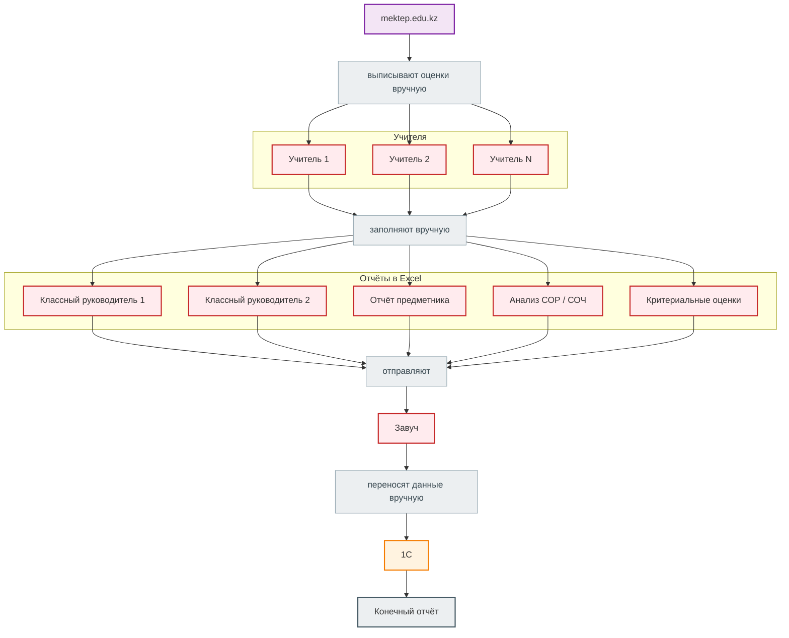
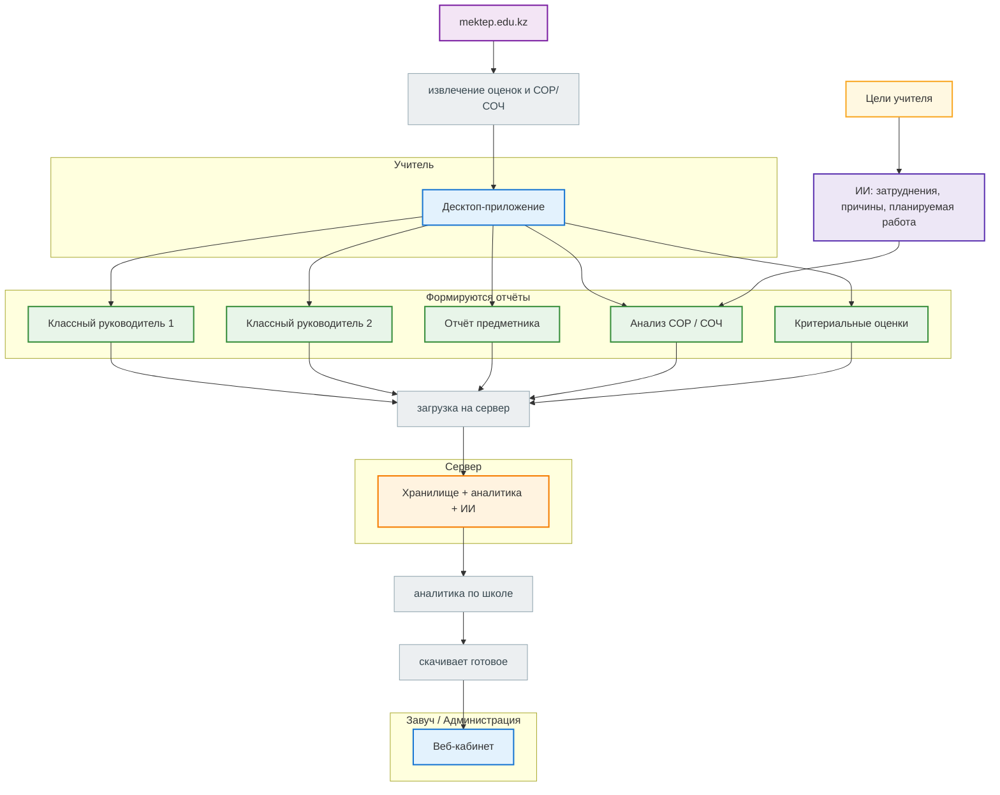
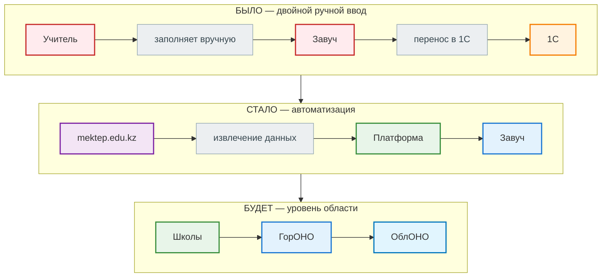
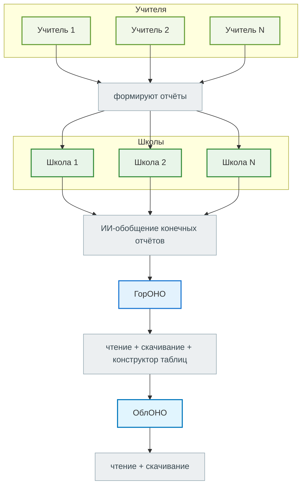

# Mektep Analyzer — презентация

> Структура выступления. Разделитель `---` = новый слайд.
> Схемы оформлены в Mermaid — рендерятся на GitHub, в VS Code (с расширением) и большинстве MD‑просмотрщиков.

---

## Слайд 0 — Титул

# Mektep Analyzer

### Автоматический сбор оценок и аналитика успеваемости для школ

От ручного переписывания оценок — к готовому отчёту за минуты

<!--
Спикер (~40 сек): Добрый день. Перед вами Mektep Analyzer — платформа, которая автоматизирует
сбор оценок с mektep.edu.kz и формирование отчётов по успеваемости. Сегодня покажу, как мы
убрали ручную рутину у учителей и завучей — и куда движется проект дальше, вплоть до уровня области.
-->

---

## Слайд 1 — Как было (до платформы)

### Вся отчётность — вручную, на каждом уровне

> **Итог: одни и те же данные переписываются руками дважды — учителем и завучом. Долго и с ошибками.**

<!--
Спикер (~1 мин): Посмотрим, как это работало раньше. Все данные живут на mektep.edu.kz.
Каждый учитель вручную выписывает оценки и заполняет стандартные отчёты: два отчёта
классного руководителя, отчёт предметника, анализ СОР и СОЧ, критериальные оценки.
Потом всё это отправляется завучу, а завуч снова вручную переносит данные в 1С и формирует
конечный отчёт. Одни и те же цифры переписываются дважды — это долго и чревато ошибками.
-->

---

## Слайд 2 — Как стало (сейчас)

### mektep.edu.kz → десктоп → сервер → завуч скачивает готовое

- Ручной ввод учителя → **0**: данные извлекаются автоматически с `mektep.edu.kz`
- Учитель задаёт только **цели обучения** — ИИ пишет анализ СОР/СОЧ
- Ручное сведение завуча → **0**: отчёты уже готовы в веб-кабинете
- Сбор данных идёт **на компьютере учителя** — пароли от `mektep.edu.kz` не передаются на сервер

<!--
Спикер (~1,5 мин): Теперь — как стало. Источник по-прежнему mektep.edu.kz, но данные
извлекаются автоматически — на компьютер учителя, в десктоп-приложение. Оттуда формируются
все те же пять видов отчётов. Единственное, что учитель добавляет сам — цели обучения.
На их основе ИИ генерирует анализ СОР/СОЧ: затруднения, причины, планируемую работу.
Готовые отчёты загружаются на сервер, там строится аналитика по школе — и завуч просто
заходит в веб-кабинет и скачивает всё готовое. Пароли от mektep.edu.kz на сервер не уходят —
сбор идёт локально, на машине учителя.
-->

---

## Слайд 3 — Эволюция: кто перестаёт работать руками

### Каждый этап убирает ручной перенос данных на новом уровне

| Этап | Кто работал вручную | Что убрала платформа |
|------|--------------------|----------------------|
| **Было** | Учитель + Завуч | — |
| **Стало** | Никто (учитель задаёт только цели) | Ввод учителя, сведение завуча, текст анализа СОР/СОЧ |
| **Будет** | Никто | Итоговое обобщение + ручные сводки ГорОНО / ОблОНО |

<!--
Спикер (~1 мин): Если обобщить — логика развития проста. На этапе «Было» руками работали
и учитель, и завуч. Сейчас учитель только задаёт цели — всё остальное делает платформа.
А в перспективе мы поднимаемся выше: от школы к ГорОНО и ОблОНО. На каждом уровне
управления убирается ручной перенос данных — один источник, готовые отчёты, без запросов
и переписывания в Excel.
-->

---

## Слайд 4 — Возможности

### Что умеет платформа сегодня

| Возможность | Описание |
|---|---|
| **Автосбор данных** | оценки и критериальное оценивание (СОР/СОЧ), прогресс в реальном времени |
| **Отчёты в один клик** | классного руководителя, предметника, годовые; Excel + Word; рус./каз. |
| **ИИ-анализ СОР/СОЧ** | затруднения, причины, планируемая работа по целям учителя |
| **Аналитика для завуча** | качество и успеваемость по классам и предметам, графики |

<!--
Спикер (~45 сек): Что платформа умеет уже сегодня. Автоматически собирает оценки и
критериальное оценивание — СОР, СОЧ — с отображением прогресса в реальном времени.
Формирует все отчёты в Excel и Word, на русском и казахском. ИИ помогает с текстовой
частью анализа. А завуч получает сводную аналитику по школе: качество, успеваемость,
графики по классам и предметам — без ручного сведения.
-->

---

## Слайд 5 — Дальнейшее развитие (за пределы школы)

### Дорожная карта: от школы к уровню области

**1. ИИ для обобщения конечных отчётов**
Система не только считает цифры, но и формирует итоговое резюме по школе: выводы, тенденции, проблемные зоны.

**2. Многоуровневая админка для ГорОНО и ОблОНО**
Новые роли только для **чтения и скачивания** отчётов — без вмешательства в данные школ. ГорОНО/ОблОНО видят всё сами, без запросов в школы.

**3. Конструктор таблиц для ГорОНО**
Сборка сводных таблиц **по конкретным пунктам** (предмет, параллель, динамика СОР/СОЧ по всем школам района).

> **Программа выходит за пределы школы и работает на уровне области.**

<!--
Спикер (~1 мин): Куда движется проект. Первое — ИИ для обобщения конечных отчётов:
не только цифры, но и готовые выводы, тенденции, проблемные зоны по школе. Второе —
админка для ГорОНО и ОблОНО: только чтение и скачивание, без вмешательства в данные
школ. Третье — конструктор таблиц для ГорОНО: можно собрать свод по конкретным
пунктам — предмет, параллель, динамика СОР/СОЧ по всем школам района. Так платформа
выходит за пределы одной школы и работает на уровне области.
-->

---

## Слайд 6 — Эффект

### Что получают школа и система образования

- **Экономия времени** — часы ручной работы → минуты, без двойного ввода
- **Меньше ошибок** — все расчёты и переносы делает система, а не человек
- **Единый стандарт** отчётов на всех уровнях
- **Наглядная аналитика** успеваемости в реальном времени
- **Двуязычность** — русский и казахский
- **Масштаб** — от одной школы до района и области

> **Главный эффект: педагоги занимаются обучением, а управленцы — решениями, а не таблицами.**

<!--
Спикер (~45 сек): Что в итоге получает школа. Часы ручной работы превращаются в минуты.
Ошибки при переносе и расчётах исчезают — всё считает система. Единый стандарт отчётов,
наглядная аналитика, два языка. И масштаб: от одного учителя до района и области.
Главное — педагоги занимаются обучением, а не таблицами.
-->

---

## Слайд 7 — Финал

# Mektep Analyzer

### Меньше рутины — больше времени на учеников

*Контакты · ссылка на скачивание · QR-код демо*

<!--
Спикер (~20 сек): Mektep Analyzer — меньше рутины, больше времени на учеников.
Спасибо за внимание. Готов ответить на вопросы и показать систему в работе.
-->

---

# Текст выступления (полная версия)

> Ориентировочное время: **6–7 минут**. Ниже — связный текст для репетиции; на слайдах — сокращённые заметки в комментариях.

## Слайд 0 — Титул (~40 сек)

Добрый день. Меня зовут [имя], и сегодня я представляю **Mektep Analyzer** — платформу для автоматического сбора оценок с портала mektep.edu.kz и формирования отчётов по успеваемости.

Каждую четверть учителя и завучи тратят часы на одну и ту же работу: переписывают оценки, заполняют таблицы, считают проценты. Мы сделали систему, которая делает это за минуты. Покажу, как было, как стало, и куда проект развивается — вплоть до уровня области.

## Слайд 1 — Как было (~1 мин)

Начнём с того, как устроена отчётность **без платформы**.

Все данные находятся на mektep.edu.kz. Каждый учитель **вручную выписывает** оттуда оценки и заполняет в Excel стандартный набор отчётов:

- два отчёта классного руководителя;
- отчёт предметника;
- анализ СОР и СОЧ;
- критериальные оценки.

Шаблоны есть, но **заполнять их каждый раз приходится вручную**. Готовые файлы учителя отправляют завучу. А завуч **снова вручную** переносит всё в 1С и формирует конечный отчёт.

Итог: **одни и те же данные переписываются дважды** — сначала учителем, потом завучом. Это долго, монотонно, и на каждом переносе накапливаются ошибки.

## Слайд 2 — Как стало (~1,5 мин)

Теперь — **как работает платформа**.

Источник данных тот же — mektep.edu.kz, он в вершине схемы. Но дальше всё идёт автоматически. Скрапер **извлекает** оценки и данные критериального оценивания — на **компьютер учителя**, в десктоп-приложение. Пароли от mektep.edu.kz **не передаются на сервер** — это важно и с точки зрения безопасности, и с точки зрения масштабирования.

Из десктопа формируются **те же пять видов отчётов**, что и раньше. Единственное, что учитель добавляет сам — **цели обучения**. На их основе **ИИ генерирует** текст анализа СОР/СОЧ: список затруднений, причины, планируемую работу — на русском или казахском.

Готовые отчёты загружаются на сервер. Там строится аналитика по всей школе. И завуч **просто заходит в веб-кабинет и скачивает** полностью готовые документы. Никакого ручного сведения, никакого переноса в 1С.

## Слайд 3 — Эволюция (~1 мин)

Если посмотреть на это в перспективе — логика развития очень простая.

**Было:** руками работали и учитель, и завуч — двойной ручной ввод.

**Стало:** учитель задаёт только цели обучения. Ввод оценок, формирование отчётов, текст анализа — всё делает платформа.

**Будет:** тот же принцип поднимается на уровень **ГорОНО и ОблОНО**. Школы формируют отчёты, район и область **видят и скачивают** готовые данные — без запросов в каждую школу и без ручных сводок в Excel.

На каждом уровне управления мы убираем ручной перенос данных. Один источник — готовые отчёты.

## Слайд 4 — Возможности (~45 сек)

Кратко — **что платформа умеет уже сегодня**.

**Автосбор данных** — оценки, СОР, СОЧ, с прогрессом в реальном времени.

**Отчёты в один клик** — классного руководителя, предметника, годовые — в Excel и Word, на двух языках.

**ИИ-анализ СОР/СОЧ** — затруднения, причины, планируемая работа по целям учителя.

**Аналитика для завуча** — качество и успеваемость по классам и предметам, графики — всё в одном веб-кабинете.

## Слайд 5 — Дальнейшее развитие (~1 мин)

Куда мы движемся дальше — **за пределы одной школы**.

**Первое** — ИИ для обобщения конечных отчётов. Система не только считает цифры, но и формирует итоговое резюме: выводы, тенденции, проблемные зоны.

**Второе** — многоуровневая админка для ГорОНО и ОблОНО. Новые роли с правом **только чтения и скачивания** — без доступа к редактированию данных школ. Руководство видит всё само, не дожидаясь отчётов от директоров.

**Третье** — **конструктор таблиц** для ГорОНО: можно собрать свод по конкретным пунктам — предмет, параллель, динамика СОР/СОЧ по всем школам района.

Так платформа становится инструментом **на уровне области**, а не только одной школы.

## Слайд 6 — Эффект (~45 сек)

Что получает школа и система образования в целом.

**Экономия времени** — часы ручной работы превращаются в минуты.

**Меньше ошибок** — расчёты и переносы делает система, не человек.

**Единый стандарт** отчётов на всех уровнях.

**Наглядная аналитика** в реальном времени.

**Двуязычность** — русский и казахский.

**Масштаб** — от одной школы до района и области.

Главный эффект: **педагоги занимаются обучением, а управленцы — принятием решений, а не заполнением таблиц**.

## Слайд 7 — Финал (~20 сек)

**Mektep Analyzer** — меньше рутины, больше времени на учеников.

Спасибо за внимание. Буду рад ответить на ваши вопросы — и при желании показать систему в работе прямо сейчас.
