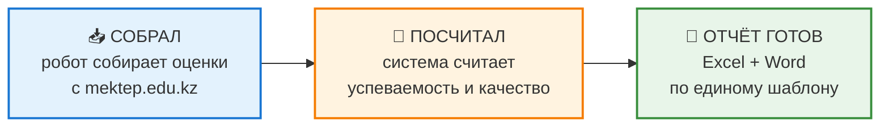
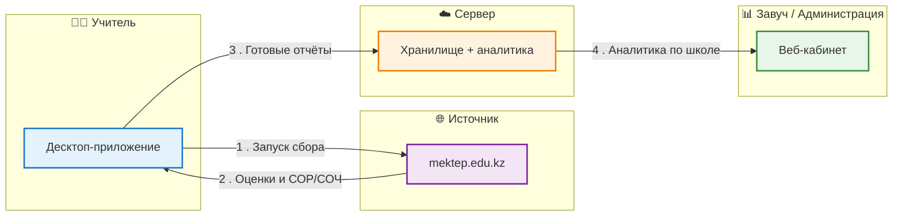
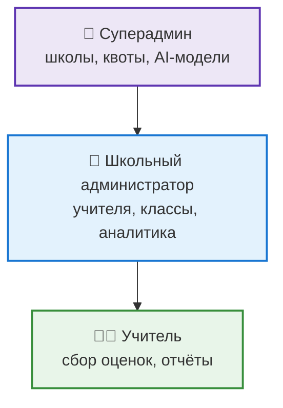

# Mektep Analyzer — презентация

> Структура выступления на 7 слайдов. Разделитель `---` = новый слайд (совместимо с Marp / reveal.js / Slidev).
> Схемы оформлены в Mermaid — рендерятся на GitHub, в VS Code (с расширением) и большинстве MD‑просмотрщиков.

---

## Слайд 0 — Титул

# Mektep Analyzer

### Автоматический сбор оценок и аналитика успеваемости для школ

От ручного переписывания оценок — к готовому отчёту за минуты

<!--
Спикер: Сегодня покажу, как автоматизировать одну из самых рутинных задач
в школе — сбор оценок и подготовку отчётов по успеваемости.
-->

---

## Слайд 1 — Проблема

### Как это происходит сейчас

- ✍️ Учителя **вручную переписывают** оценки из `mektep.edu.kz` в таблицы
- 🧮 Завучи **вручную считают** качество знаний и успеваемость (%)
- 📑 Отчёты предметника и классного руководителя готовятся **с нуля** каждую четверть
- 📋 Стандарт отчётов **есть**, но заполнять его всё равно приходится **вручную каждый раз**

> **Итог: долго, монотонно, с ошибками в расчётах.**

<!--
Спикер: Каждую четверть сотни оценок переносятся руками.
Это часы работы и неизбежные ошибки в процентах.
-->

---

## Слайд 2 — Решение

### Mektep Analyzer — три шага вместо часов работы

- Робот сам заходит на `mektep.edu.kz` и собирает оценки (включая **СОР/СОЧ**)
- Все показатели успеваемости считаются **автоматически**
- Готовые отчёты формируются по **единому шаблону**

<!--
Спикер: Учитель нажимает одну кнопку — программа делает всё остальное.
-->

---

## Слайд 3 — Как это работает

### Поток данных: учитель → mektep.edu.kz → сервер → завуч

> 🔐 **Ключевая идея:** сбор данных идёт **на компьютере учителя** под его учётными данными.
> Пароли от `mektep.edu.kz` **не передаются** на сервер → безопасно и масштабируемо.

<!--
Спикер: Нагрузка распределена по компьютерам учителей,
а сервер только хранит результаты и строит аналитику.
-->

---

## Слайд 4 — Возможности (1/2)

### Что умеет платформа

| | Возможность |
|---|---|
| 🤖 | **Автосбор данных** — оценки и критериальное оценивание (СОР/СОЧ), прогресс в реальном времени |
| 📄 | **Отчёты в один клик** — предметника, классного руководителя, годовые; Excel + Word; рус./каз. |
| 📊 | **Аналитика для завуча** — качество и успеваемость по классам и предметам, графики |

---

## Слайд 5 — Возможности (2/2)

| | Возможность |
|---|---|
| 👥 | **Роли и школы** — Суперадмин → Школа → Учитель; один учитель в нескольких школах |
| 🧠 | **AI-помощник** — авто-генерация анализа: трудности, причины, рекомендации (рус./каз.) |
| 🔄 | **Удобство** — десктоп с автообновлением, интерфейс на двух языках |

### Иерархия ролей

<!--
Спикер: Категории учеников — отличники, хорошисты, "с одной четвёркой",
неуспевающие — считаются автоматически.
-->

---

## Слайд 6 — Эффект

### Что получает школа

- ⏱️ **Экономия времени** — часы ручной работы → минуты
- 📐 **Единый стандарт** отчётов по всей школе
- 📈 **Наглядная аналитика** успеваемости в реальном времени
- ✅ **Меньше ошибок** — все проценты считает система
- 🌐 **Двуязычность** — русский и казахский

> **Главный эффект: учителя занимаются обучением, а не таблицами.**

---

## Слайд 7 — Финал

# Mektep Analyzer

### Меньше рутины — больше времени на учеников

*Контакты · ссылка на скачивание · QR-код демо*

<!--
Спикер: Готов показать систему в работе прямо сейчас.
-->
